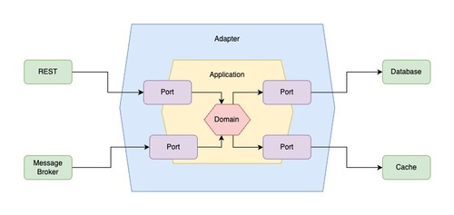

# Introduction
Hexagonal Architecture, also known as Ports and Adapters pattern, is a software design approach that structures an application so that its core business logic (the domain) is isolated from external systems and technologies. This architecture was proposed by Alistair Cockburn in 2005 and has gained popularity due to its effectiveness in creating maintainable and testable software systems.

# Background
The need for Hexagonal Architecture arose from the challenges faced in traditional layered architectures, where business logic often became tightly coupled with external systems such as databases, user interfaces, or messaging platforms. This coupling made it difficult to adapt to changing requirements, replace technologies, or test the core logic in isolation.

# Requirement
The application must be able to evolve independently of external systems, such as databases, APIs, or user interfaces. It should allow for easy replacement or modification of these external dependencies without impacting the core business logic. Testing the core logic in isolation is essential, requiring clear boundaries between the domain and infrastructure.

# Terminology
|Term|	Description|
|-| -|
|Port|	Interface defining how the application communicates with the outside world.|
|Adapter|	Component implementing a port to connect external systems or technologies to the core.|
|Domain|	Core business logic and rules, independent of external systems or frameworks.|
|Application|	Layer that coordinates activities and orchestrates domain logic.|
|REST|	External entity interacting with the application through an adapter using RESTful APIs.|
|Message| Broker	External entity communicating asynchronously with the application via an adapter for messaging.|
|Database|	External entity responsible for data persistence and retrieval, accessed through an adapter.|
|Cache|	External entity providing fast, temporary data storage, accessed through an adapter.|

# Core Principles
Hexagonal Architecture is built on several key principles that enable clean, maintainable code:

1. Separation of Concerns
> Clearly separate business logic from infrastructure and external dependencies, allowing each part to evolve independently.
2. Dependency Inversion
> Domain logic should not depend on external frameworks or technologies. Instead, dependencies point inward toward the domain.
3. Ports as Interfaces
> efine explicit interfaces (ports) that specify how the application interacts with the outside world, creating clear boundaries.
4. Adapters as Implementations
> Implement ports with adapters that connect external technologies to the application core, making components interchangeable.
5. Domain Centricity
> Place the domain logic at the center of the application, making it the most important part and focus of development.

# Benefits
Adopting Hexagonal Architecture in Prabogo provides numerous advantages for developers:
1. Decoupling
> Business logic remains independent of frameworks, databases, user interfaces, and other infrastructure concerns, allowing each component to evolve separately.
2. Testability
> The core application can be tested in isolation by substituting real external systems with mocks or stubs, leading to more reliable and robust tests.
3. Maintainability
> It's easier to replace or modify external technologies without affecting the core logic, reducing the risk of introducing bugs when making changes.
4. Flexibility
> New requirements or technologies can be integrated with minimal impact on the core, making your application adaptable to changing business needs and technological advancements.
5. Clear Boundaries
> Explicit interfaces (ports) and adapters manage interactions between the core and external components, creating a well-defined architecture that's easier to understand and navigate.

# Project Structure
Prabogo implements Hexagonal Architecture with the following directory structure:
```
prabogo/
├── cmd/
│   └── main.go                  # Application entry point
├── internal/
│   ├── app.go                   # Application setup
│   ├── domain/                  # Domain layer (business logic)
│   │   ├── registry.go          # Domain service registry
│   │   └── entity/              # Domain logic for entity
│   │       ├── domain.go        # Implementation
│   │       └── domain_test.go   # Unit tests
│   ├── port/                    # Interfaces (ports)
│   │   ├── inbound/             # Input ports
│   │   │   ├── entity.go        # Entity ports
│   │   │   └── registry_*.go    # Port registries
│   │   └── outbound/            # Output ports
│   │       ├── entity.go        # Entity port
│   │       └── registry_*.go    # Port registries
│   ├── adapter/                 # Adapters implementing ports
│   │   ├── inbound/             # Input adapters
│   │   │   ├── command/         # CLI adapters
│   │   │   ├── fiber/           # HTTP adapters
│   │   │   └── rabbitmq/        # Message queue adapters
│   │   └── outbound/            # Output adapters
│   │       ├── postgres/        # Database adapters
│   │       ├── http/            # HTTP client adapters
│   │       ├── rabbitmq/        # Message publishing adapters
│   │       └── redis/           # Cache adapters
│   ├── model/                   # Data structures
│   │   ├── entity.go            # Entity model
│   │   ├── request.go           # Request models
│   │   └── response.go          # Response models
│   └── migration/               # Database migrations
│       └── postgres/
│           └── 1_entity.go      # Entity table migration
└── utils/                       # Utility functions and helpers
```

# Domain Layer
The domain layer contains the core business logic of your application, free from external dependencies and technologies. This is where you implement your business rules and workflows.

## Example Domain Service
``` go
package client

import (
	"context"

	"github.com/palantir/stacktrace"
	"github.com/redis/go-redis/v9"

	"prabogo/internal/model"
	outbound_port "prabogo/internal/port/outbound"
)

type ClientDomain interface {
	Upsert(ctx context.Context, inputs []model.ClientInput) ([]model.Client, error)
	FindByFilter(ctx context.Context, filter model.ClientFilter) ([]model.Client, error)
	DeleteByFilter(ctx context.Context, filter model.ClientFilter) error
	PublishUpsert(ctx context.Context, inputs []model.ClientInput) error
	IsExists(ctx context.Context, bearerKey string) (bool, error)
}

type clientDomain struct {
	databasePort outbound_port.DatabasePort
	messagePort  outbound_port.MessagePort
	cachePort    outbound_port.CachePort
}

func NewClientDomain(
	databasePort outbound_port.DatabasePort,
	messagePort outbound_port.MessagePort,
	cachePort outbound_port.CachePort,
) ClientDomain {
	return &clientDomain{
		databasePort: databasePort,
		messagePort:  messagePort,
		cachePort:    cachePort,
	}
}

func (s *clientDomain) Upsert(ctx context.Context, inputs []model.ClientInput) ([]model.Client, error) {
	// Business logic here
	return nil, nil
}

func (s *clientDomain) FindByFilter(ctx context.Context, filter model.ClientFilter) ([]model.Client, error) {
	// Business logic here
	return nil, nil
}

func (s *clientDomain) DeleteByFilter(ctx context.Context, filter model.ClientFilter) error {
	// Business logic here
	return nil
}

func (s *clientDomain) PublishUpsert(ctx context.Context, inputs []model.ClientInput) error {
	// Business logic here
	return nil
}

func (s *clientDomain) IsExists(ctx context.Context, bearerKey string) (bool, error) {
	// Business logic here
	return true, nil
}
```

Note how the domain logic only depends on ports (interfaces) rather than concrete implementations, allowing for easy testing and replacement of external dependencies.

# Ports
Ports define the interfaces through which the domain communicates with the outside world. There are two types of ports:

## Inbound Ports (Primary Ports)
These are interfaces that allow external systems to communicate with the application core.

``` go
package inbound_port

type ClientHttpPort interface {
	Upsert(a any) error
	Find(a any) error
	Delete(a any) error
}

type ClientMessagePort interface {
	Upsert(a any) bool
}

type ClientCommandPort interface {
	PublishUpsert(name string)
}
```

# Outbound Ports (Secondary Ports)
These are interfaces that the application core uses to communicate with external systems.

``` go
package outbound_port

import "prabogo/internal/model"

//go:generate mockgen -source=client.go -destination=./../../../tests/mocks/port/mock_client.go
type ClientDatabasePort interface {
	Upsert(datas []model.ClientInput) error
	FindByFilter(filter model.ClientFilter, lock bool) ([]model.Client, error)
	DeleteByFilter(filter model.ClientFilter) error
	IsExists(bearerKey string) (bool, error)
}

type ClientMessagePort interface {
	PublishUpsert(datas []model.ClientInput) error
}

type ClientCachePort interface {
	Set(data model.Client) error
	Get(bearerKey string) (model.Client, error)
}
```

# Adapters
Adapters implement the ports and connect the application core to external systems. There are two types of adapters:

## Inbound Adapters (Primary Adapters)
These adapt external requests to the application's inbound ports.

##  HTTP Adapter Example
``` go
package fiber_inbound_adapter

import (
	"context"

	"prabogo/internal/domain"
	inbound_port "prabogo/internal/port/inbound"
)

type clientAdapter struct {
	domain domain.Domain
}

func NewClientAdapter(
	domain domain.Domain,
) inbound_port.ClientHttpPort {
	return &clientAdapter{
		domain: domain,
	}
}

func (h *clientAdapter) Upsert(a any) error {
	// http adapter here
  return nil
}

func (h *clientAdapter) Find(a any) error {
	// http adapter here
  return nil
}

func (h *clientAdapter) Delete(a any) error {
	// http adapter here
  return nil
}
```

## Outbound Adapters (Secondary Adapters)
These adapt the application's outbound ports to external systems.

## Database Adapter Example
``` go
package postgres_outbound_adapter

import (
	"prabogo/internal/model"
	outbound_port "prabogo/internal/port/outbound"
)

type clientAdapter struct {
	db outbound_port.DatabaseExecutor
}

func NewClientAdapter(
	db outbound_port.DatabaseExecutor,
) outbound_port.ClientDatabasePort {
	return &clientAdapter{
		db: db,
	}
}

func (adapter *clientAdapter) Upsert(datas []model.ClientInput) error {
	// database adapter here
	return nil
}

func (adapter *clientAdapter) FindByFilter(filter model.ClientFilter, lock bool) (result []model.Client, err error) {
	// database adapter here
	return nil, nil
}

func (adapter *clientAdapter) DeleteByFilter(filter model.ClientFilter) error {
	// database adapter here
	return nil
}

func (adapter *clientAdapter) IsExists(bearerKey string) (bool, error) {
	// database adapter here
	return true, nil
}
```

# Dependencies Flow
The dependencies in a hexagonal architecture follow the Dependency Inversion Principle:
1. Domain logic depends on abstractions (ports), not concrete implementations (adapters).
2. Both domain logic and adapters reside in separate packages/modules.
3. The domain is at the center and doesn't know about the adapters.
4. Adapters depend on the ports they implement, not the other way around.



This dependency flow ensures that the domain remains isolated from external concerns and can be developed, tested, and maintained independently.
No newline at end of file
