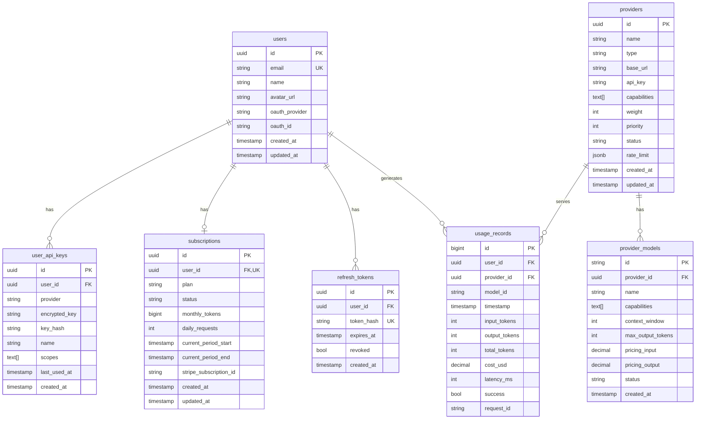

# P0 核心模块设计

> **版本**: v1.0 | **更新**: 2026-01-04
> **范围**: Shared + Auth + Provider + Routing + Billing
> **目标**: 完成 AI 代理服务 MVP

---

## 一、模块概览

### 1.1 模块职责

```
┌─────────────────────────────────────────────────────────────────┐
│                        P0 模块架构                               │
├─────────────────────────────────────────────────────────────────┤
│                                                                  │
│   ┌─────────────────────────────────────────────────────────┐   │
│   │                      API Gateway                         │   │
│   │              路由 │ 认证 │ 限流 │ 日志                   │   │
│   └─────────────────────────────────────────────────────────┘   │
│                              │                                   │
│          ┌───────────────────┼───────────────────┐              │
│          ▼                   ▼                   ▼              │
│   ┌────────────┐      ┌────────────┐      ┌────────────┐       │
│   │    Auth    │      │  Routing   │      │  Billing   │       │
│   │            │      │            │      │            │       │
│   │ • OAuth    │      │ • 策略链   │      │ • 用量记录 │       │
│   │ • JWT      │      │ • 负载均衡 │      │ • 配额管理 │       │
│   │ • API Key  │      │ • 熔断转移 │      │ • 订阅计划 │       │
│   └────────────┘      └─────┬──────┘      └────────────┘       │
│                             │                                   │
│                      ┌──────▼──────┐                            │
│                      │  Provider   │                            │
│                      │             │                            │
│                      │ • 注册表    │                            │
│                      │ • 适配器    │                            │
│                      │ • 健康监控  │                            │
│                      └─────────────┘                            │
│                             │                                   │
│   ┌─────────────────────────────────────────────────────────┐   │
│   │                  Shared Infrastructure                   │   │
│   │        Config │ Database │ Cache │ Crypto │ Errors      │   │
│   └─────────────────────────────────────────────────────────┘   │
│                                                                  │
└─────────────────────────────────────────────────────────────────┘
```

### 1.2 模块依赖矩阵

| 模块 | 依赖 | 被依赖 |
|------|------|--------|
| Shared | - | Auth, Provider, Routing, Billing |
| Auth | Shared | Routing, Billing |
| Provider | Shared | Routing |
| Routing | Shared, Auth, Provider, Billing | - |
| Billing | Shared, Auth | Routing |

### 1.3 请求流程

```
┌────────┐     ┌─────────┐     ┌────────┐     ┌──────────┐     ┌──────────┐
│ Client │────▶│ Gateway │────▶│  Auth  │────▶│ Routing  │────▶│ Provider │
└────────┘     └─────────┘     └────────┘     └────┬─────┘     └────┬─────┘
                                                   │                 │
                                                   ▼                 ▼
                                              ┌─────────┐     ┌───────────┐
                                              │ Billing │     │ AI Service│
                                              └─────────┘     │ (OpenAI)  │
                                                              └───────────┘
```

---

## 二、Shared Infrastructure

### 2.1 目录结构

```
internal/shared/
├── config/
│   ├── config.go           # 配置结构定义
│   ├── loader.go           # 配置加载（Viper）
│   └── env.go              # 环境变量映射
├── database/
│   ├── postgres.go         # PostgreSQL 连接
│   ├── timescale.go        # TimescaleDB 扩展
│   └── migrations.go       # 迁移管理
├── cache/
│   ├── redis.go            # Redis 客户端
│   └── keys.go             # Key 命名规范
├── crypto/
│   ├── aes.go              # AES-256-GCM 加密
│   ├── hash.go             # 哈希工具（bcrypt, sha256）
│   └── random.go           # 安全随机数
├── middleware/
│   ├── auth.go             # 认证中间件
│   ├── ratelimit.go        # 限流中间件
│   ├── cors.go             # CORS 中间件
│   ├── logger.go           # 请求日志
│   └── recovery.go         # 错误恢复
├── errors/
│   ├── codes.go            # 错误码定义
│   ├── errors.go           # 错误类型
│   └── handler.go          # 统一错误处理
└── logger/
    └── zap.go              # 日志初始化
```

### 2.2 配置管理

```go
// config/config.go

type Config struct {
    Server   ServerConfig   `mapstructure:"server"`
    Database DatabaseConfig `mapstructure:"database"`
    Redis    RedisConfig    `mapstructure:"redis"`
    JWT      JWTConfig      `mapstructure:"jwt"`
    OAuth    OAuthConfig    `mapstructure:"oauth"`
    Crypto   CryptoConfig   `mapstructure:"crypto"`
}

type ServerConfig struct {
    Port         int           `mapstructure:"port" default:"8080"`
    Mode         string        `mapstructure:"mode" default:"debug"` // debug/release
    ReadTimeout  time.Duration `mapstructure:"read_timeout" default:"30s"`
    WriteTimeout time.Duration `mapstructure:"write_timeout" default:"30s"`
}

type DatabaseConfig struct {
    Host            string        `mapstructure:"host" default:"localhost"`
    Port            int           `mapstructure:"port" default:"5432"`
    User            string        `mapstructure:"user"`
    Password        string        `mapstructure:"password"`
    DBName          string        `mapstructure:"dbname"`
    SSLMode         string        `mapstructure:"sslmode" default:"disable"`
    MaxOpenConns    int           `mapstructure:"max_open_conns" default:"25"`
    MaxIdleConns    int           `mapstructure:"max_idle_conns" default:"5"`
    ConnMaxLifetime time.Duration `mapstructure:"conn_max_lifetime" default:"5m"`
}

type RedisConfig struct {
    Host     string `mapstructure:"host" default:"localhost"`
    Port     int    `mapstructure:"port" default:"6379"`
    Password string `mapstructure:"password"`
    DB       int    `mapstructure:"db" default:"0"`
    PoolSize int    `mapstructure:"pool_size" default:"10"`
}

type JWTConfig struct {
    Secret           string        `mapstructure:"secret"`
    AccessExpiry     time.Duration `mapstructure:"access_expiry" default:"15m"`
    RefreshExpiry    time.Duration `mapstructure:"refresh_expiry" default:"7d"`
    Issuer           string        `mapstructure:"issuer" default:"uniedit"`
}

type OAuthConfig struct {
    GitHub GitHubOAuthConfig `mapstructure:"github"`
    Google GoogleOAuthConfig `mapstructure:"google"`
}

type CryptoConfig struct {
    AESKey string `mapstructure:"aes_key"` // 32 bytes for AES-256
}
```

### 2.3 错误处理

```go
// errors/codes.go

const (
    // 通用错误 (1xxx)
    CodeSuccess         = 0
    CodeInternalError   = 1000
    CodeInvalidRequest  = 1001
    CodeNotFound        = 1002

    // 认证错误 (2xxx)
    CodeUnauthorized    = 2000
    CodeTokenExpired    = 2001
    CodeTokenInvalid    = 2002
    CodePermissionDenied = 2003

    // 配额错误 (3xxx)
    CodeQuotaExceeded   = 3000
    CodeRateLimited     = 3001

    // Provider 错误 (4xxx)
    CodeProviderError   = 4000
    CodeProviderTimeout = 4001
    CodeNoAvailable     = 4002
)

// errors/errors.go

type AppError struct {
    Code    int    `json:"code"`
    Message string `json:"message"`
    Detail  string `json:"detail,omitempty"`
    Err     error  `json:"-"`
}

func (e *AppError) Error() string {
    return e.Message
}

func (e *AppError) Unwrap() error {
    return e.Err
}

// 预定义错误
var (
    ErrNotFound        = &AppError{Code: CodeNotFound, Message: "resource not found"}
    ErrUnauthorized    = &AppError{Code: CodeUnauthorized, Message: "unauthorized"}
    ErrQuotaExceeded   = &AppError{Code: CodeQuotaExceeded, Message: "quota exceeded"}
    ErrRateLimited     = &AppError{Code: CodeRateLimited, Message: "rate limited"}
    ErrNoProvider      = &AppError{Code: CodeNoAvailable, Message: "no available provider"}
)

// 错误包装
func Wrap(err error, code int, message string) *AppError {
    return &AppError{
        Code:    code,
        Message: message,
        Err:     err,
    }
}
```

### 2.4 加密工具

```go
// crypto/aes.go

type AESCrypto struct {
    key []byte
}

func NewAESCrypto(key string) (*AESCrypto, error) {
    keyBytes := []byte(key)
    if len(keyBytes) != 32 {
        return nil, errors.New("AES key must be 32 bytes")
    }
    return &AESCrypto{key: keyBytes}, nil
}

// Encrypt encrypts plaintext using AES-256-GCM
func (c *AESCrypto) Encrypt(plaintext string) (string, error) {
    block, err := aes.NewCipher(c.key)
    if err != nil {
        return "", err
    }

    gcm, err := cipher.NewGCM(block)
    if err != nil {
        return "", err
    }

    nonce := make([]byte, gcm.NonceSize())
    if _, err := io.ReadFull(rand.Reader, nonce); err != nil {
        return "", err
    }

    ciphertext := gcm.Seal(nonce, nonce, []byte(plaintext), nil)
    return base64.StdEncoding.EncodeToString(ciphertext), nil
}

// Decrypt decrypts ciphertext using AES-256-GCM
func (c *AESCrypto) Decrypt(ciphertext string) (string, error) {
    data, err := base64.StdEncoding.DecodeString(ciphertext)
    if err != nil {
        return "", err
    }

    block, err := aes.NewCipher(c.key)
    if err != nil {
        return "", err
    }

    gcm, err := cipher.NewGCM(block)
    if err != nil {
        return "", err
    }

    nonceSize := gcm.NonceSize()
    if len(data) < nonceSize {
        return "", errors.New("ciphertext too short")
    }

    nonce, ciphertext := data[:nonceSize], data[nonceSize:]
    plaintext, err := gcm.Open(nil, nonce, ciphertext, nil)
    if err != nil {
        return "", err
    }

    return string(plaintext), nil
}
```

---

## 三、Auth Module

### 3.1 目录结构

```
internal/module/auth/
├── handler.go              # HTTP Handler
├── service.go              # 业务逻辑
├── repository.go           # 数据访问
├── model.go                # 数据模型
├── dto.go                  # 请求/响应 DTO
├── jwt.go                  # JWT 工具
├── errors.go               # 模块错误
├── oauth/                  # OAuth 提供商
│   ├── interface.go        # OAuth 接口
│   ├── github.go           # GitHub OAuth
│   └── google.go           # Google OAuth
└── middleware.go           # 认证中间件
```

### 3.2 数据模型

```go
// model.go

type User struct {
    ID            uuid.UUID  `gorm:"type:uuid;primary_key;default:gen_random_uuid()"`
    Email         string     `gorm:"uniqueIndex;not null"`
    Name          string     `gorm:"not null"`
    AvatarURL     string
    OAuthProvider string     `gorm:"not null"` // github, google
    OAuthID       string     `gorm:"not null"`
    CreatedAt     time.Time  `gorm:"autoCreateTime"`
    UpdatedAt     time.Time  `gorm:"autoUpdateTime"`

    // Relations
    APIKeys      []UserAPIKey `gorm:"foreignKey:UserID"`
    Subscription *Subscription `gorm:"foreignKey:UserID"`
}

func (User) TableName() string { return "users" }

type UserAPIKey struct {
    ID           uuid.UUID  `gorm:"type:uuid;primary_key;default:gen_random_uuid()"`
    UserID       uuid.UUID  `gorm:"type:uuid;not null;index"`
    Provider     string     `gorm:"not null"` // openai, anthropic, ...
    EncryptedKey string     `gorm:"not null"` // AES-256-GCM encrypted
    KeyHash      string     `gorm:"not null;index"` // SHA-256 hash for lookup
    Name         string     `gorm:"not null"`
    Scopes       []string   `gorm:"type:text[];not null"` // chat, image, video
    LastUsedAt   *time.Time
    CreatedAt    time.Time  `gorm:"autoCreateTime"`
}

func (UserAPIKey) TableName() string { return "user_api_keys" }

type RefreshToken struct {
    ID        uuid.UUID `gorm:"type:uuid;primary_key;default:gen_random_uuid()"`
    UserID    uuid.UUID `gorm:"type:uuid;not null;index"`
    TokenHash string    `gorm:"not null;uniqueIndex"`
    ExpiresAt time.Time `gorm:"not null"`
    Revoked   bool      `gorm:"default:false"`
    CreatedAt time.Time `gorm:"autoCreateTime"`
}

func (RefreshToken) TableName() string { return "refresh_tokens" }
```

### 3.3 核心接口

```go
// service.go

type Service interface {
    // OAuth
    GetOAuthURL(provider string, state string) (string, error)
    HandleOAuthCallback(ctx context.Context, provider, code string) (*TokenPair, error)

    // Token
    RefreshToken(ctx context.Context, refreshToken string) (*TokenPair, error)
    RevokeToken(ctx context.Context, refreshToken string) error
    ValidateToken(ctx context.Context, accessToken string) (*User, error)

    // User
    GetUser(ctx context.Context, userID uuid.UUID) (*User, error)
    UpdateUser(ctx context.Context, userID uuid.UUID, req *UpdateUserRequest) (*User, error)

    // API Key
    CreateAPIKey(ctx context.Context, userID uuid.UUID, req *CreateAPIKeyRequest) (*UserAPIKey, error)
    ListAPIKeys(ctx context.Context, userID uuid.UUID) ([]*UserAPIKey, error)
    DeleteAPIKey(ctx context.Context, userID uuid.UUID, keyID uuid.UUID) error
    RotateAPIKey(ctx context.Context, userID uuid.UUID, keyID uuid.UUID) (*UserAPIKey, error)
    GetDecryptedKey(ctx context.Context, userID uuid.UUID, provider string) (string, error)
}

type TokenPair struct {
    AccessToken  string    `json:"access_token"`
    RefreshToken string    `json:"refresh_token"`
    ExpiresAt    time.Time `json:"expires_at"`
    TokenType    string    `json:"token_type"`
}

// repository.go

type Repository interface {
    // User
    CreateUser(ctx context.Context, user *User) error
    GetUserByID(ctx context.Context, id uuid.UUID) (*User, error)
    GetUserByOAuth(ctx context.Context, provider, oauthID string) (*User, error)
    UpdateUser(ctx context.Context, user *User) error

    // API Key
    CreateAPIKey(ctx context.Context, key *UserAPIKey) error
    GetAPIKeyByID(ctx context.Context, id uuid.UUID) (*UserAPIKey, error)
    GetAPIKeysByUser(ctx context.Context, userID uuid.UUID) ([]*UserAPIKey, error)
    GetAPIKeyByUserAndProvider(ctx context.Context, userID uuid.UUID, provider string) (*UserAPIKey, error)
    UpdateAPIKey(ctx context.Context, key *UserAPIKey) error
    DeleteAPIKey(ctx context.Context, id uuid.UUID) error

    // Refresh Token
    CreateRefreshToken(ctx context.Context, token *RefreshToken) error
    GetRefreshToken(ctx context.Context, tokenHash string) (*RefreshToken, error)
    RevokeRefreshToken(ctx context.Context, tokenHash string) error
    CleanExpiredTokens(ctx context.Context) error
}
```

### 3.4 OAuth 接口

```go
// oauth/interface.go

type OAuthProvider interface {
    // GetAuthURL returns the OAuth authorization URL
    GetAuthURL(state string) string

    // ExchangeCode exchanges authorization code for tokens
    ExchangeCode(ctx context.Context, code string) (*OAuthToken, error)

    // GetUserInfo fetches user info using the access token
    GetUserInfo(ctx context.Context, token *OAuthToken) (*OAuthUserInfo, error)
}

type OAuthToken struct {
    AccessToken  string
    RefreshToken string
    ExpiresAt    time.Time
}

type OAuthUserInfo struct {
    ID        string
    Email     string
    Name      string
    AvatarURL string
}

// oauth/github.go

type GitHubProvider struct {
    clientID     string
    clientSecret string
    redirectURL  string
}

func NewGitHubProvider(clientID, clientSecret, redirectURL string) *GitHubProvider {
    return &GitHubProvider{
        clientID:     clientID,
        clientSecret: clientSecret,
        redirectURL:  redirectURL,
    }
}

func (p *GitHubProvider) GetAuthURL(state string) string {
    params := url.Values{
        "client_id":    {p.clientID},
        "redirect_uri": {p.redirectURL},
        "scope":        {"user:email"},
        "state":        {state},
    }
    return "https://github.com/login/oauth/authorize?" + params.Encode()
}
```

### 3.5 JWT 实现

```go
// jwt.go

type JWTManager struct {
    secret        []byte
    accessExpiry  time.Duration
    refreshExpiry time.Duration
    issuer        string
}

type Claims struct {
    UserID uuid.UUID `json:"user_id"`
    Email  string    `json:"email"`
    jwt.RegisteredClaims
}

func NewJWTManager(cfg *config.JWTConfig) *JWTManager {
    return &JWTManager{
        secret:        []byte(cfg.Secret),
        accessExpiry:  cfg.AccessExpiry,
        refreshExpiry: cfg.RefreshExpiry,
        issuer:        cfg.Issuer,
    }
}

func (m *JWTManager) GenerateAccessToken(user *User) (string, time.Time, error) {
    expiresAt := time.Now().Add(m.accessExpiry)

    claims := &Claims{
        UserID: user.ID,
        Email:  user.Email,
        RegisteredClaims: jwt.RegisteredClaims{
            ExpiresAt: jwt.NewNumericDate(expiresAt),
            IssuedAt:  jwt.NewNumericDate(time.Now()),
            Issuer:    m.issuer,
            Subject:   user.ID.String(),
        },
    }

    token := jwt.NewWithClaims(jwt.SigningMethodHS256, claims)
    signedToken, err := token.SignedString(m.secret)
    if err != nil {
        return "", time.Time{}, err
    }

    return signedToken, expiresAt, nil
}

func (m *JWTManager) ValidateToken(tokenString string) (*Claims, error) {
    token, err := jwt.ParseWithClaims(tokenString, &Claims{}, func(token *jwt.Token) (interface{}, error) {
        if _, ok := token.Method.(*jwt.SigningMethodHMAC); !ok {
            return nil, fmt.Errorf("unexpected signing method: %v", token.Header["alg"])
        }
        return m.secret, nil
    })

    if err != nil {
        return nil, err
    }

    if claims, ok := token.Claims.(*Claims); ok && token.Valid {
        return claims, nil
    }

    return nil, errors.New("invalid token")
}

func (m *JWTManager) GenerateRefreshToken() (string, string, time.Time, error) {
    // Generate random token
    bytes := make([]byte, 32)
    if _, err := rand.Read(bytes); err != nil {
        return "", "", time.Time{}, err
    }

    token := base64.URLEncoding.EncodeToString(bytes)
    hash := sha256.Sum256([]byte(token))
    tokenHash := hex.EncodeToString(hash[:])
    expiresAt := time.Now().Add(m.refreshExpiry)

    return token, tokenHash, expiresAt, nil
}
```

### 3.6 API 接口

```yaml
# Auth API

POST /api/v1/auth/login:
  description: 获取 OAuth 登录 URL
  request:
    provider: github | google
  response:
    url: string
    state: string

GET /api/v1/auth/callback/{provider}:
  description: OAuth 回调
  query:
    code: string
    state: string
  response:
    access_token: string
    refresh_token: string
    expires_at: timestamp
    token_type: Bearer

POST /api/v1/auth/refresh:
  description: 刷新 Token
  request:
    refresh_token: string
  response:
    access_token: string
    refresh_token: string
    expires_at: timestamp

POST /api/v1/auth/logout:
  description: 登出（撤销 Refresh Token）
  headers:
    Authorization: Bearer {access_token}
  request:
    refresh_token: string

# User API

GET /api/v1/users/me:
  description: 获取当前用户信息
  headers:
    Authorization: Bearer {access_token}
  response:
    id: uuid
    email: string
    name: string
    avatar_url: string
    created_at: timestamp

PATCH /api/v1/users/me:
  description: 更新用户信息
  request:
    name: string (optional)
    avatar_url: string (optional)

# API Key API

GET /api/v1/keys:
  description: 列出用户的 API Key
  response:
    items:
      - id: uuid
        provider: string
        name: string
        scopes: string[]
        last_used_at: timestamp
        created_at: timestamp

POST /api/v1/keys:
  description: 创建 API Key
  request:
    provider: openai | anthropic | ...
    api_key: string
    name: string
    scopes: string[]
  response:
    id: uuid
    provider: string
    name: string

DELETE /api/v1/keys/{id}:
  description: 删除 API Key

POST /api/v1/keys/{id}/rotate:
  description: 轮换 API Key
  request:
    new_api_key: string
  response:
    id: uuid
    provider: string
    name: string
```

---

## 四、Provider Module

### 4.1 目录结构

```
internal/module/provider/
├── handler.go              # HTTP Handler（管理接口）
├── service.go              # 业务逻辑
├── repository.go           # 数据访问
├── model.go                # 数据模型
├── registry.go             # 提供商注册表
├── health.go               # 健康监控
├── circuit_breaker.go      # 熔断器
├── rate_limiter.go         # 速率限制
└── adapter/                # 提供商适配器
    ├── interface.go        # 适配器接口
    ├── base.go             # 基础实现
    ├── openai.go           # OpenAI 适配器
    ├── anthropic.go        # Anthropic 适配器
    └── factory.go          # 适配器工厂
```

### 4.2 数据模型

```go
// model.go

type ProviderType string

const (
    ProviderTypeOpenAI    ProviderType = "openai"
    ProviderTypeAnthropic ProviderType = "anthropic"
    ProviderTypeGemini    ProviderType = "gemini"
    ProviderTypeDeepSeek  ProviderType = "deepseek"
)

type ProviderStatus string

const (
    ProviderStatusActive      ProviderStatus = "active"
    ProviderStatusDisabled    ProviderStatus = "disabled"
    ProviderStatusMaintenance ProviderStatus = "maintenance"
)

type Capability string

const (
    CapabilityChat   Capability = "chat"
    CapabilityVision Capability = "vision"
    CapabilityTools  Capability = "tools"
    CapabilityImage  Capability = "image"
    CapabilityAudio  Capability = "audio"
)

type Provider struct {
    ID           uuid.UUID       `gorm:"type:uuid;primary_key;default:gen_random_uuid()"`
    Name         string          `gorm:"not null"`
    Type         ProviderType    `gorm:"not null"`
    BaseURL      string          `gorm:"not null"`
    APIKey       string          `gorm:"not null"` // AES-256 encrypted
    Capabilities []Capability    `gorm:"type:text[];not null"`
    Weight       int             `gorm:"default:1"`
    Priority     int             `gorm:"default:0"`
    Status       ProviderStatus  `gorm:"default:active"`
    RateLimit    *RateLimitConfig `gorm:"type:jsonb"`
    CreatedAt    time.Time       `gorm:"autoCreateTime"`
    UpdatedAt    time.Time       `gorm:"autoUpdateTime"`

    // Relations
    Models []ProviderModel `gorm:"foreignKey:ProviderID"`
}

type RateLimitConfig struct {
    RPM          int `json:"rpm"`           // Requests per minute
    TPM          int `json:"tpm"`           // Tokens per minute
    DailyLimit   int `json:"daily_limit"`   // Daily request limit
}

type ProviderModel struct {
    ID              string         `gorm:"primary_key"`
    ProviderID      uuid.UUID      `gorm:"type:uuid;not null;index"`
    Name            string         `gorm:"not null"`
    Capabilities    []Capability   `gorm:"type:text[];not null"`
    ContextWindow   int            `gorm:"not null"`
    MaxOutputTokens int            `gorm:"not null"`
    PricingInput    float64        `gorm:"type:decimal(10,6)"` // $ per 1M tokens
    PricingOutput   float64        `gorm:"type:decimal(10,6)"`
    Status          string         `gorm:"default:active"` // active, deprecated, preview
    CreatedAt       time.Time      `gorm:"autoCreateTime"`
}
```

### 4.3 注册表设计

```go
// registry.go

type Registry interface {
    // 注册管理
    Register(provider *Provider, adapter Adapter) error
    Unregister(providerID uuid.UUID) error

    // 查询
    Get(providerID uuid.UUID) (*RegisteredProvider, bool)
    GetByType(providerType ProviderType) []*RegisteredProvider
    List() []*RegisteredProvider

    // 能力查询
    FindByCapability(cap Capability) []*RegisteredProvider
    FindByModel(modelID string) []*RegisteredProvider

    // 健康状态
    GetHealth(providerID uuid.UUID) (*HealthStatus, error)
    UpdateHealth(providerID uuid.UUID, status *HealthStatus) error

    // 状态变更
    SetStatus(providerID uuid.UUID, status ProviderStatus) error
}

type RegisteredProvider struct {
    Provider *Provider
    Adapter  Adapter
    Health   *HealthStatus
}

type registry struct {
    mu        sync.RWMutex
    providers map[uuid.UUID]*RegisteredProvider
    byType    map[ProviderType][]*RegisteredProvider
    byModel   map[string][]*RegisteredProvider

    healthMgr *HealthManager
    cache     cache.Cache
    logger    *zap.Logger
}

func NewRegistry(healthMgr *HealthManager, cache cache.Cache, logger *zap.Logger) Registry {
    return &registry{
        providers: make(map[uuid.UUID]*RegisteredProvider),
        byType:    make(map[ProviderType][]*RegisteredProvider),
        byModel:   make(map[string][]*RegisteredProvider),
        healthMgr: healthMgr,
        cache:     cache,
        logger:    logger,
    }
}

func (r *registry) Register(provider *Provider, adapter Adapter) error {
    r.mu.Lock()
    defer r.mu.Unlock()

    rp := &RegisteredProvider{
        Provider: provider,
        Adapter:  adapter,
        Health:   &HealthStatus{State: CircuitStateClosed},
    }

    r.providers[provider.ID] = rp
    r.byType[provider.Type] = append(r.byType[provider.Type], rp)

    // Index by model
    for _, model := range provider.Models {
        r.byModel[model.ID] = append(r.byModel[model.ID], rp)
    }

    r.logger.Info("provider registered",
        zap.String("id", provider.ID.String()),
        zap.String("type", string(provider.Type)),
    )

    return nil
}

func (r *registry) FindByCapability(cap Capability) []*RegisteredProvider {
    r.mu.RLock()
    defer r.mu.RUnlock()

    var result []*RegisteredProvider
    for _, rp := range r.providers {
        if rp.Provider.Status != ProviderStatusActive {
            continue
        }
        for _, c := range rp.Provider.Capabilities {
            if c == cap {
                result = append(result, rp)
                break
            }
        }
    }
    return result
}
```

### 4.4 熔断器设计

```go
// circuit_breaker.go

type CircuitState string

const (
    CircuitStateClosed   CircuitState = "closed"
    CircuitStateOpen     CircuitState = "open"
    CircuitStateHalfOpen CircuitState = "half_open"
)

type CircuitBreakerConfig struct {
    FailureThreshold   int           `json:"failure_threshold"`   // 触发熔断的连续失败次数
    SuccessThreshold   int           `json:"success_threshold"`   // 恢复关闭的连续成功次数
    Timeout            time.Duration `json:"timeout"`             // 熔断超时时间
    HalfOpenMaxCalls   int           `json:"half_open_max_calls"` // 半开状态最大尝试次数
}

var DefaultCircuitBreakerConfig = CircuitBreakerConfig{
    FailureThreshold: 5,
    SuccessThreshold: 2,
    Timeout:          30 * time.Second,
    HalfOpenMaxCalls: 3,
}

type CircuitBreaker struct {
    mu                   sync.RWMutex
    state                CircuitState
    consecutiveFailures  int
    consecutiveSuccesses int
    lastFailureTime      time.Time
    halfOpenCalls        int
    config               CircuitBreakerConfig
}

func NewCircuitBreaker(config CircuitBreakerConfig) *CircuitBreaker {
    return &CircuitBreaker{
        state:  CircuitStateClosed,
        config: config,
    }
}

func (cb *CircuitBreaker) CanExecute() bool {
    cb.mu.RLock()
    defer cb.mu.RUnlock()

    switch cb.state {
    case CircuitStateClosed:
        return true
    case CircuitStateOpen:
        if time.Since(cb.lastFailureTime) > cb.config.Timeout {
            return true // Will transition to half-open
        }
        return false
    case CircuitStateHalfOpen:
        return cb.halfOpenCalls < cb.config.HalfOpenMaxCalls
    }
    return false
}

func (cb *CircuitBreaker) RecordSuccess() {
    cb.mu.Lock()
    defer cb.mu.Unlock()

    cb.consecutiveFailures = 0

    switch cb.state {
    case CircuitStateHalfOpen:
        cb.consecutiveSuccesses++
        if cb.consecutiveSuccesses >= cb.config.SuccessThreshold {
            cb.state = CircuitStateClosed
            cb.consecutiveSuccesses = 0
            cb.halfOpenCalls = 0
        }
    }
}

func (cb *CircuitBreaker) RecordFailure() {
    cb.mu.Lock()
    defer cb.mu.Unlock()

    cb.consecutiveSuccesses = 0
    cb.consecutiveFailures++
    cb.lastFailureTime = time.Now()

    switch cb.state {
    case CircuitStateClosed:
        if cb.consecutiveFailures >= cb.config.FailureThreshold {
            cb.state = CircuitStateOpen
        }
    case CircuitStateHalfOpen:
        cb.state = CircuitStateOpen
        cb.halfOpenCalls = 0
    }
}

func (cb *CircuitBreaker) State() CircuitState {
    cb.mu.Lock()
    defer cb.mu.Unlock()

    // Check for timeout transition
    if cb.state == CircuitStateOpen && time.Since(cb.lastFailureTime) > cb.config.Timeout {
        cb.state = CircuitStateHalfOpen
        cb.halfOpenCalls = 0
    }

    return cb.state
}
```

### 4.5 适配器接口

```go
// adapter/interface.go

type Adapter interface {
    // 基本信息
    ID() uuid.UUID
    Type() ProviderType
    Name() string

    // 能力查询
    Capabilities() []Capability
    Models() []*ProviderModel
    SupportsModel(modelID string) bool

    // 请求处理
    Chat(ctx context.Context, req *ChatRequest) (*ChatResponse, error)
    ChatStream(ctx context.Context, req *ChatRequest) (<-chan *ChatChunk, error)

    // 健康检查
    HealthCheck(ctx context.Context) error
}

type ChatRequest struct {
    Model       string         `json:"model"`
    Messages    []Message      `json:"messages"`
    MaxTokens   int            `json:"max_tokens,omitempty"`
    Temperature float64        `json:"temperature,omitempty"`
    Stream      bool           `json:"stream,omitempty"`
    Tools       []Tool         `json:"tools,omitempty"`
    Metadata    map[string]any `json:"metadata,omitempty"`
}

type Message struct {
    Role    string `json:"role"` // system, user, assistant
    Content string `json:"content"`
}

type ChatResponse struct {
    ID      string  `json:"id"`
    Model   string  `json:"model"`
    Choices []Choice `json:"choices"`
    Usage   Usage    `json:"usage"`
}

type Choice struct {
    Index        int      `json:"index"`
    Message      Message  `json:"message"`
    FinishReason string   `json:"finish_reason"`
}

type Usage struct {
    PromptTokens     int `json:"prompt_tokens"`
    CompletionTokens int `json:"completion_tokens"`
    TotalTokens      int `json:"total_tokens"`
}

type ChatChunk struct {
    ID      string `json:"id"`
    Model   string `json:"model"`
    Delta   Delta  `json:"delta"`
    Done    bool   `json:"done"`
}

type Delta struct {
    Role    string `json:"role,omitempty"`
    Content string `json:"content,omitempty"`
}
```

### 4.6 OpenAI 适配器

```go
// adapter/openai.go

type OpenAIAdapter struct {
    provider *Provider
    client   *http.Client
    baseURL  string
    apiKey   string
}

func NewOpenAIAdapter(provider *Provider, apiKey string) *OpenAIAdapter {
    return &OpenAIAdapter{
        provider: provider,
        client:   &http.Client{Timeout: 120 * time.Second},
        baseURL:  provider.BaseURL,
        apiKey:   apiKey,
    }
}

func (a *OpenAIAdapter) ID() uuid.UUID      { return a.provider.ID }
func (a *OpenAIAdapter) Type() ProviderType { return a.provider.Type }
func (a *OpenAIAdapter) Name() string       { return a.provider.Name }

func (a *OpenAIAdapter) Chat(ctx context.Context, req *ChatRequest) (*ChatResponse, error) {
    body, err := json.Marshal(req)
    if err != nil {
        return nil, fmt.Errorf("marshal request: %w", err)
    }

    httpReq, err := http.NewRequestWithContext(ctx, "POST", a.baseURL+"/v1/chat/completions", bytes.NewReader(body))
    if err != nil {
        return nil, fmt.Errorf("create request: %w", err)
    }

    httpReq.Header.Set("Content-Type", "application/json")
    httpReq.Header.Set("Authorization", "Bearer "+a.apiKey)

    resp, err := a.client.Do(httpReq)
    if err != nil {
        return nil, fmt.Errorf("execute request: %w", err)
    }
    defer resp.Body.Close()

    if resp.StatusCode != http.StatusOK {
        body, _ := io.ReadAll(resp.Body)
        return nil, fmt.Errorf("API error: %d - %s", resp.StatusCode, string(body))
    }

    var chatResp ChatResponse
    if err := json.NewDecoder(resp.Body).Decode(&chatResp); err != nil {
        return nil, fmt.Errorf("decode response: %w", err)
    }

    return &chatResp, nil
}

func (a *OpenAIAdapter) ChatStream(ctx context.Context, req *ChatRequest) (<-chan *ChatChunk, error) {
    req.Stream = true
    body, err := json.Marshal(req)
    if err != nil {
        return nil, fmt.Errorf("marshal request: %w", err)
    }

    httpReq, err := http.NewRequestWithContext(ctx, "POST", a.baseURL+"/v1/chat/completions", bytes.NewReader(body))
    if err != nil {
        return nil, fmt.Errorf("create request: %w", err)
    }

    httpReq.Header.Set("Content-Type", "application/json")
    httpReq.Header.Set("Authorization", "Bearer "+a.apiKey)
    httpReq.Header.Set("Accept", "text/event-stream")

    resp, err := a.client.Do(httpReq)
    if err != nil {
        return nil, fmt.Errorf("execute request: %w", err)
    }

    if resp.StatusCode != http.StatusOK {
        body, _ := io.ReadAll(resp.Body)
        resp.Body.Close()
        return nil, fmt.Errorf("API error: %d - %s", resp.StatusCode, string(body))
    }

    chunks := make(chan *ChatChunk)

    go func() {
        defer close(chunks)
        defer resp.Body.Close()

        scanner := bufio.NewScanner(resp.Body)
        for scanner.Scan() {
            line := scanner.Text()
            if !strings.HasPrefix(line, "data: ") {
                continue
            }

            data := strings.TrimPrefix(line, "data: ")
            if data == "[DONE]" {
                chunks <- &ChatChunk{Done: true}
                return
            }

            var chunk ChatChunk
            if err := json.Unmarshal([]byte(data), &chunk); err != nil {
                continue
            }

            select {
            case chunks <- &chunk:
            case <-ctx.Done():
                return
            }
        }
    }()

    return chunks, nil
}

func (a *OpenAIAdapter) HealthCheck(ctx context.Context) error {
    // Simple model list request to check connectivity
    httpReq, err := http.NewRequestWithContext(ctx, "GET", a.baseURL+"/v1/models", nil)
    if err != nil {
        return err
    }

    httpReq.Header.Set("Authorization", "Bearer "+a.apiKey)

    resp, err := a.client.Do(httpReq)
    if err != nil {
        return err
    }
    defer resp.Body.Close()

    if resp.StatusCode != http.StatusOK {
        return fmt.Errorf("health check failed: %d", resp.StatusCode)
    }

    return nil
}
```

---

## 五、Routing Module

### 5.1 目录结构

```
internal/module/routing/
├── handler.go              # HTTP Handler
├── service.go              # 业务逻辑
├── router.go               # 路由管理器
├── dto.go                  # 请求/响应 DTO
├── errors.go               # 模块错误
├── stream.go               # 流式响应处理
├── strategy/               # 路由策略
│   ├── interface.go        # 策略接口
│   ├── chain.go            # 策略链
│   ├── priority.go         # 优先级策略
│   ├── health.go           # 健康过滤策略
│   ├── capability.go       # 能力匹配策略
│   ├── load_balance.go     # 负载均衡策略
│   └── cost.go             # 成本优化策略
└── group/                  # 分组管理
    ├── group.go            # 模型分组
    └── execution.go        # 执行分组
```

### 5.2 核心接口

```go
// router.go

// Router 路由管理器接口
type Router interface {
    // Route 根据请求选择最佳提供商
    Route(ctx context.Context, req *RouteRequest) (*RouteResult, error)

    // Execute 执行请求
    Execute(ctx context.Context, result *RouteResult, req *ChatRequest) (*ChatResponse, error)

    // ExecuteStream 流式执行请求
    ExecuteStream(ctx context.Context, result *RouteResult, req *ChatRequest) (<-chan *ChatChunk, error)
}

type RouteRequest struct {
    Model        string            // 指定模型或 "auto"
    Capabilities []Capability      // 需要的能力
    Preferences  *RoutePreferences // 路由偏好
}

type RoutePreferences struct {
    PreferredProviders []uuid.UUID   // 偏好的提供商
    ExcludedProviders  []uuid.UUID   // 排除的提供商
    Strategy           StrategyType  // 路由策略
    MaxLatency         time.Duration // 最大延迟要求
    MaxCost            float64       // 最大成本要求
}

type RouteResult struct {
    Provider *RegisteredProvider
    Model    *ProviderModel
    Score    float64
    Reason   string
}

// service.go

type Service interface {
    // Chat 处理聊天请求
    Chat(ctx context.Context, userID uuid.UUID, req *ChatAPIRequest) (*ChatAPIResponse, error)

    // ChatStream 处理流式聊天请求
    ChatStream(ctx context.Context, userID uuid.UUID, req *ChatAPIRequest) (<-chan *ChatAPIChunk, error)
}

type ChatAPIRequest struct {
    Model       string         `json:"model"`
    Messages    []Message      `json:"messages"`
    MaxTokens   int            `json:"max_tokens,omitempty"`
    Temperature float64        `json:"temperature,omitempty"`
    Stream      bool           `json:"stream,omitempty"`
    Routing     *RoutingConfig `json:"routing,omitempty"`
}

type RoutingConfig struct {
    Strategy  string   `json:"strategy,omitempty"`   // priority, cost, quality, latency
    Fallback  bool     `json:"fallback,omitempty"`   // 是否启用故障转移
    Timeout   int      `json:"timeout,omitempty"`    // 超时时间(ms)
    Providers []string `json:"providers,omitempty"`  // 指定提供商
}

type ChatAPIResponse struct {
    ID      string   `json:"id"`
    Model   string   `json:"model"`
    Choices []Choice `json:"choices"`
    Usage   Usage    `json:"usage"`

    // 路由元信息
    Routing *RoutingMeta `json:"_routing,omitempty"`
}

type RoutingMeta struct {
    ProviderUsed string  `json:"provider_used"`
    ModelUsed    string  `json:"model_used"`
    LatencyMs    int64   `json:"latency_ms"`
    CostUSD      float64 `json:"cost_usd"`
}
```

### 5.3 策略链设计

```go
// strategy/interface.go

type Strategy interface {
    // Name 策略名称
    Name() string

    // Priority 策略优先级（越高越先执行）
    Priority() int

    // Apply 应用策略
    // 可以过滤候选者或调整分数
    Apply(ctx *RoutingContext, candidates []*ScoredProvider) []*ScoredProvider
}

type RoutingContext struct {
    Request     *RouteRequest
    UserID      uuid.UUID
    Preferences *RoutePreferences
    Metadata    map[string]any
}

type ScoredProvider struct {
    Provider *RegisteredProvider
    Model    *ProviderModel
    Score    float64
    Reasons  []string
}

// strategy/chain.go

type Chain struct {
    strategies []Strategy
    logger     *zap.Logger
}

func NewChain(strategies []Strategy, logger *zap.Logger) *Chain {
    // Sort by priority descending
    sort.Slice(strategies, func(i, j int) bool {
        return strategies[i].Priority() > strategies[j].Priority()
    })

    return &Chain{
        strategies: strategies,
        logger:     logger,
    }
}

func (c *Chain) Route(ctx *RoutingContext, candidates []*RegisteredProvider) (*RouteResult, error) {
    if len(candidates) == 0 {
        return nil, ErrNoProvider
    }

    // Initialize scored providers
    scored := make([]*ScoredProvider, 0, len(candidates))
    for _, rp := range candidates {
        for _, model := range rp.Provider.Models {
            scored = append(scored, &ScoredProvider{
                Provider: rp,
                Model:    &model,
                Score:    0,
                Reasons:  []string{},
            })
        }
    }

    // Apply each strategy
    for _, strategy := range c.strategies {
        scored = strategy.Apply(ctx, scored)

        c.logger.Debug("strategy applied",
            zap.String("strategy", strategy.Name()),
            zap.Int("remaining", len(scored)),
        )

        if len(scored) == 0 {
            return nil, fmt.Errorf("no candidates after %s strategy", strategy.Name())
        }
    }

    // Sort by score descending
    sort.Slice(scored, func(i, j int) bool {
        return scored[i].Score > scored[j].Score
    })

    best := scored[0]
    return &RouteResult{
        Provider: best.Provider,
        Model:    best.Model,
        Score:    best.Score,
        Reason:   strings.Join(best.Reasons, "; "),
    }, nil
}
```

### 5.4 策略实现

```go
// strategy/health.go

type HealthFilterStrategy struct{}

func (s *HealthFilterStrategy) Name() string     { return "health_filter" }
func (s *HealthFilterStrategy) Priority() int    { return 100 }

func (s *HealthFilterStrategy) Apply(ctx *RoutingContext, candidates []*ScoredProvider) []*ScoredProvider {
    result := make([]*ScoredProvider, 0, len(candidates))

    for _, sp := range candidates {
        health := sp.Provider.Health
        if health == nil || health.State == CircuitStateClosed || health.State == CircuitStateHalfOpen {
            result = append(result, sp)
        }
    }

    return result
}

// strategy/capability.go

type CapabilityFilterStrategy struct{}

func (s *CapabilityFilterStrategy) Name() string  { return "capability_filter" }
func (s *CapabilityFilterStrategy) Priority() int { return 90 }

func (s *CapabilityFilterStrategy) Apply(ctx *RoutingContext, candidates []*ScoredProvider) []*ScoredProvider {
    if len(ctx.Request.Capabilities) == 0 {
        return candidates
    }

    result := make([]*ScoredProvider, 0, len(candidates))

    for _, sp := range candidates {
        modelCaps := make(map[Capability]bool)
        for _, cap := range sp.Model.Capabilities {
            modelCaps[cap] = true
        }

        hasAll := true
        for _, reqCap := range ctx.Request.Capabilities {
            if !modelCaps[reqCap] {
                hasAll = false
                break
            }
        }

        if hasAll {
            result = append(result, sp)
        }
    }

    return result
}

// strategy/priority.go

type PriorityStrategy struct{}

func (s *PriorityStrategy) Name() string  { return "priority" }
func (s *PriorityStrategy) Priority() int { return 50 }

func (s *PriorityStrategy) Apply(ctx *RoutingContext, candidates []*ScoredProvider) []*ScoredProvider {
    for _, sp := range candidates {
        // Higher priority = higher score
        sp.Score += float64(sp.Provider.Provider.Priority) * 10
        sp.Reasons = append(sp.Reasons, fmt.Sprintf("priority=%d", sp.Provider.Provider.Priority))
    }
    return candidates
}

// strategy/load_balance.go

type LoadBalanceStrategy struct {
    counter atomic.Uint64
}

func (s *LoadBalanceStrategy) Name() string  { return "load_balance" }
func (s *LoadBalanceStrategy) Priority() int { return 40 }

func (s *LoadBalanceStrategy) Apply(ctx *RoutingContext, candidates []*ScoredProvider) []*ScoredProvider {
    for _, sp := range candidates {
        // Weighted random score
        weight := float64(sp.Provider.Provider.Weight)
        sp.Score += weight * rand.Float64()
        sp.Reasons = append(sp.Reasons, fmt.Sprintf("weight=%d", sp.Provider.Provider.Weight))
    }
    return candidates
}

// strategy/cost.go

type CostOptimizationStrategy struct{}

func (s *CostOptimizationStrategy) Name() string  { return "cost_optimization" }
func (s *CostOptimizationStrategy) Priority() int { return 60 }

func (s *CostOptimizationStrategy) Apply(ctx *RoutingContext, candidates []*ScoredProvider) []*ScoredProvider {
    if len(candidates) == 0 {
        return candidates
    }

    // Find min and max cost
    minCost := math.MaxFloat64
    maxCost := 0.0

    for _, sp := range candidates {
        cost := sp.Model.PricingInput + sp.Model.PricingOutput
        if cost < minCost {
            minCost = cost
        }
        if cost > maxCost {
            maxCost = cost
        }
    }

    // Normalize and score (lower cost = higher score)
    costRange := maxCost - minCost
    if costRange == 0 {
        return candidates
    }

    for _, sp := range candidates {
        cost := sp.Model.PricingInput + sp.Model.PricingOutput
        normalizedCost := (maxCost - cost) / costRange
        sp.Score += normalizedCost * 20
        sp.Reasons = append(sp.Reasons, fmt.Sprintf("cost=%.4f", cost))
    }

    return candidates
}
```

### 5.5 服务实现

```go
// service.go

type service struct {
    registry    provider.Registry
    router      Router
    billing     billing.Recorder
    authService auth.Service
    logger      *zap.Logger
}

func NewService(
    registry provider.Registry,
    router Router,
    billing billing.Recorder,
    authService auth.Service,
    logger *zap.Logger,
) Service {
    return &service{
        registry:    registry,
        router:      router,
        billing:     billing,
        authService: authService,
        logger:      logger,
    }
}

func (s *service) Chat(ctx context.Context, userID uuid.UUID, req *ChatAPIRequest) (*ChatAPIResponse, error) {
    startTime := time.Now()

    // 1. Build route request
    routeReq := &RouteRequest{
        Model: req.Model,
        Capabilities: []Capability{CapabilityChat},
    }

    if req.Routing != nil {
        routeReq.Preferences = &RoutePreferences{
            Strategy: StrategyType(req.Routing.Strategy),
        }
    }

    // 2. Route to best provider
    candidates := s.registry.List()
    routeResult, err := s.router.Route(ctx, routeReq)
    if err != nil {
        return nil, fmt.Errorf("route failed: %w", err)
    }

    // 3. Get decrypted API key (user's or platform's)
    apiKey, err := s.getAPIKey(ctx, userID, routeResult.Provider.Provider)
    if err != nil {
        return nil, fmt.Errorf("get api key: %w", err)
    }

    // 4. Execute request
    chatReq := &provider.ChatRequest{
        Model:       routeResult.Model.ID,
        Messages:    req.Messages,
        MaxTokens:   req.MaxTokens,
        Temperature: req.Temperature,
    }

    adapter := routeResult.Provider.Adapter
    chatResp, err := adapter.Chat(ctx, chatReq)

    latency := time.Since(startTime)

    // 5. Update health status
    if err != nil {
        routeResult.Provider.Health.CircuitBreaker.RecordFailure()
        return nil, fmt.Errorf("chat failed: %w", err)
    }
    routeResult.Provider.Health.CircuitBreaker.RecordSuccess()

    // 6. Calculate cost
    cost := s.calculateCost(routeResult.Model, chatResp.Usage)

    // 7. Record usage
    if err := s.billing.RecordUsage(ctx, &billing.UsageRecord{
        UserID:       userID,
        ProviderID:   routeResult.Provider.Provider.ID,
        ModelID:      routeResult.Model.ID,
        InputTokens:  chatResp.Usage.PromptTokens,
        OutputTokens: chatResp.Usage.CompletionTokens,
        CostUSD:      cost,
        LatencyMs:    int(latency.Milliseconds()),
        Success:      true,
    }); err != nil {
        s.logger.Error("failed to record usage", zap.Error(err))
    }

    // 8. Build response
    return &ChatAPIResponse{
        ID:      chatResp.ID,
        Model:   chatResp.Model,
        Choices: chatResp.Choices,
        Usage:   chatResp.Usage,
        Routing: &RoutingMeta{
            ProviderUsed: routeResult.Provider.Provider.Name,
            ModelUsed:    routeResult.Model.ID,
            LatencyMs:    latency.Milliseconds(),
            CostUSD:      cost,
        },
    }, nil
}

func (s *service) calculateCost(model *provider.ProviderModel, usage provider.Usage) float64 {
    inputCost := float64(usage.PromptTokens) / 1_000_000 * model.PricingInput
    outputCost := float64(usage.CompletionTokens) / 1_000_000 * model.PricingOutput
    return inputCost + outputCost
}
```

### 5.6 API 接口

```yaml
POST /api/v1/ai/chat:
  description: 聊天补全
  headers:
    Authorization: Bearer {access_token}
  request:
    model: string           # 模型 ID 或 "auto"
    messages:
      - role: string        # system, user, assistant
        content: string
    max_tokens: int         # 可选
    temperature: float      # 可选，0-2
    routing:                # 可选
      strategy: string      # priority, cost, quality, latency
      fallback: bool
      timeout: int          # ms
  response:
    id: string
    model: string
    choices:
      - index: int
        message:
          role: string
          content: string
        finish_reason: string
    usage:
      prompt_tokens: int
      completion_tokens: int
      total_tokens: int
    _routing:
      provider_used: string
      model_used: string
      latency_ms: int
      cost_usd: float

POST /api/v1/ai/chat/stream:
  description: 流式聊天（SSE）
  headers:
    Authorization: Bearer {access_token}
    Accept: text/event-stream
  response:
    event: message
    data:
      id: string
      delta:
        content: string
      done: bool
```

---

## 六、Billing Module

### 6.1 目录结构

```
internal/module/billing/
├── handler.go              # HTTP Handler
├── service.go              # 业务逻辑
├── repository.go           # 数据访问
├── model.go                # 数据模型
├── quota.go                # 配额管理
├── recorder.go             # 用量记录接口
└── errors.go               # 模块错误
```

### 6.2 数据模型

```go
// model.go

type PlanType string

const (
    PlanFree       PlanType = "free"
    PlanPro        PlanType = "pro"
    PlanTeam       PlanType = "team"
    PlanEnterprise PlanType = "enterprise"
)

type SubscriptionStatus string

const (
    SubscriptionStatusActive   SubscriptionStatus = "active"
    SubscriptionStatusCanceled SubscriptionStatus = "canceled"
    SubscriptionStatusPastDue  SubscriptionStatus = "past_due"
)

type Subscription struct {
    ID                   uuid.UUID          `gorm:"type:uuid;primary_key;default:gen_random_uuid()"`
    UserID               uuid.UUID          `gorm:"type:uuid;not null;uniqueIndex"`
    Plan                 PlanType           `gorm:"not null;default:free"`
    Status               SubscriptionStatus `gorm:"not null;default:active"`
    MonthlyTokens        int64              `gorm:"not null"`
    DailyRequests        int                `gorm:"not null"`
    CurrentPeriodStart   time.Time          `gorm:"not null"`
    CurrentPeriodEnd     time.Time          `gorm:"not null"`
    StripeSubscriptionID string             // Phase 2
    StripeCustomerID     string             // Phase 2
    CreatedAt            time.Time          `gorm:"autoCreateTime"`
    UpdatedAt            time.Time          `gorm:"autoUpdateTime"`
}

// 订阅计划配置
var PlanConfigs = map[PlanType]struct {
    MonthlyTokens int64
    DailyRequests int
    PriceUSD      float64
}{
    PlanFree:       {MonthlyTokens: 10_000, DailyRequests: 100, PriceUSD: 0},
    PlanPro:        {MonthlyTokens: 500_000, DailyRequests: 2_000, PriceUSD: 20},
    PlanTeam:       {MonthlyTokens: 2_000_000, DailyRequests: 10_000, PriceUSD: 50},
    PlanEnterprise: {MonthlyTokens: -1, DailyRequests: -1, PriceUSD: -1}, // Unlimited
}

// UsageRecord - TimescaleDB 超表
type UsageRecord struct {
    ID           int64     `gorm:"primaryKey;autoIncrement"`
    UserID       uuid.UUID `gorm:"type:uuid;not null;index:idx_usage_user_time"`
    ProviderID   uuid.UUID `gorm:"type:uuid;not null"`
    ModelID      string    `gorm:"not null"`
    Timestamp    time.Time `gorm:"not null;index:idx_usage_user_time"` // 分区键
    InputTokens  int       `gorm:"not null"`
    OutputTokens int       `gorm:"not null"`
    TotalTokens  int       `gorm:"not null"`
    CostUSD      float64   `gorm:"type:decimal(10,6);not null"`
    LatencyMs    int       `gorm:"not null"`
    Success      bool      `gorm:"not null"`
    RequestID    string    // 请求追踪 ID
}

func (UsageRecord) TableName() string { return "usage_records" }
```

### 6.3 核心接口

```go
// recorder.go

// Recorder 用量记录接口（供 Routing 模块调用）
type Recorder interface {
    RecordUsage(ctx context.Context, record *UsageRecord) error
}

// service.go

type Service interface {
    // 配额
    CheckQuota(ctx context.Context, userID uuid.UUID) (*QuotaStatus, error)
    ConsumeQuota(ctx context.Context, userID uuid.UUID, tokens int) error

    // 订阅
    GetSubscription(ctx context.Context, userID uuid.UUID) (*Subscription, error)
    CreateSubscription(ctx context.Context, userID uuid.UUID, plan PlanType) (*Subscription, error)

    // 用量统计
    GetUsageStats(ctx context.Context, userID uuid.UUID, period Period) (*UsageStats, error)
    GetDailyUsage(ctx context.Context, userID uuid.UUID, date time.Time) (*DailyUsage, error)
}

type QuotaStatus struct {
    Plan            PlanType `json:"plan"`
    TokensUsed      int64    `json:"tokens_used"`
    TokensLimit     int64    `json:"tokens_limit"`
    TokensRemaining int64    `json:"tokens_remaining"`
    RequestsToday   int      `json:"requests_today"`
    RequestsLimit   int      `json:"requests_limit"`
    PeriodEnd       time.Time `json:"period_end"`
}

type UsageStats struct {
    Period        string  `json:"period"`
    TotalTokens   int64   `json:"total_tokens"`
    TotalRequests int64   `json:"total_requests"`
    TotalCostUSD  float64 `json:"total_cost_usd"`
    ByProvider    map[string]*ProviderUsage `json:"by_provider"`
    ByModel       map[string]*ModelUsage    `json:"by_model"`
}

type Period string

const (
    PeriodDay   Period = "day"
    PeriodWeek  Period = "week"
    PeriodMonth Period = "month"
)
```

### 6.4 配额管理

```go
// quota.go

type QuotaManager struct {
    repo   Repository
    cache  cache.Cache
    logger *zap.Logger
}

func NewQuotaManager(repo Repository, cache cache.Cache, logger *zap.Logger) *QuotaManager {
    return &QuotaManager{
        repo:   repo,
        cache:  cache,
        logger: logger,
    }
}

// Redis keys
const (
    keyMonthlyTokens  = "quota:tokens:%s:%s"    // quota:tokens:{user_id}:{period}
    keyDailyRequests  = "quota:requests:%s:%s"  // quota:requests:{user_id}:{date}
)

func (m *QuotaManager) CheckQuota(ctx context.Context, userID uuid.UUID) (*QuotaStatus, error) {
    // Get subscription
    sub, err := m.repo.GetSubscription(ctx, userID)
    if err != nil {
        return nil, err
    }

    config := PlanConfigs[sub.Plan]

    // Get current usage from Redis
    period := time.Now().Format("2006-01")
    tokensKey := fmt.Sprintf(keyMonthlyTokens, userID.String(), period)
    tokensUsed, _ := m.cache.Get(ctx, tokensKey).Int64()

    date := time.Now().Format("2006-01-02")
    requestsKey := fmt.Sprintf(keyDailyRequests, userID.String(), date)
    requestsToday, _ := m.cache.Get(ctx, requestsKey).Int()

    return &QuotaStatus{
        Plan:            sub.Plan,
        TokensUsed:      tokensUsed,
        TokensLimit:     config.MonthlyTokens,
        TokensRemaining: config.MonthlyTokens - tokensUsed,
        RequestsToday:   requestsToday,
        RequestsLimit:   config.DailyRequests,
        PeriodEnd:       sub.CurrentPeriodEnd,
    }, nil
}

func (m *QuotaManager) ConsumeQuota(ctx context.Context, userID uuid.UUID, tokens int) error {
    // Atomic increment in Redis
    period := time.Now().Format("2006-01")
    tokensKey := fmt.Sprintf(keyMonthlyTokens, userID.String(), period)

    pipe := m.cache.Pipeline()
    pipe.IncrBy(ctx, tokensKey, int64(tokens))
    pipe.Expire(ctx, tokensKey, 35*24*time.Hour) // Expire after ~35 days

    date := time.Now().Format("2006-01-02")
    requestsKey := fmt.Sprintf(keyDailyRequests, userID.String(), date)
    pipe.Incr(ctx, requestsKey)
    pipe.Expire(ctx, requestsKey, 25*time.Hour) // Expire after ~25 hours

    _, err := pipe.Exec(ctx)
    return err
}

func (m *QuotaManager) IsQuotaExceeded(ctx context.Context, userID uuid.UUID) (bool, error) {
    status, err := m.CheckQuota(ctx, userID)
    if err != nil {
        return false, err
    }

    config := PlanConfigs[status.Plan]

    // Unlimited plan
    if config.MonthlyTokens == -1 {
        return false, nil
    }

    // Check monthly tokens
    if status.TokensUsed >= config.MonthlyTokens {
        return true, nil
    }

    // Check daily requests
    if status.RequestsToday >= config.DailyRequests {
        return true, nil
    }

    return false, nil
}
```

### 6.5 API 接口

```yaml
GET /api/v1/billing/subscription:
  description: 获取当前订阅
  response:
    plan: string
    status: string
    monthly_tokens: int
    daily_requests: int
    current_period_start: timestamp
    current_period_end: timestamp

GET /api/v1/billing/quota:
  description: 获取配额状态
  response:
    plan: string
    tokens_used: int
    tokens_limit: int
    tokens_remaining: int
    requests_today: int
    requests_limit: int
    period_end: timestamp

GET /api/v1/billing/usage:
  description: 获取用量统计
  query:
    period: day | week | month
    start_date: date (optional)
    end_date: date (optional)
  response:
    period: string
    total_tokens: int
    total_requests: int
    total_cost_usd: float
    by_provider:
      openai:
        tokens: int
        requests: int
        cost_usd: float
    by_model:
      gpt-4o:
        tokens: int
        requests: int
        cost_usd: float
```

---

## 七、数据库设计

### 7.1 ER 图



### 7.2 迁移文件

```sql
-- migrations/000001_create_users.up.sql

CREATE EXTENSION IF NOT EXISTS "uuid-ossp";
CREATE EXTENSION IF NOT EXISTS "pgcrypto";

CREATE TABLE users (
    id UUID PRIMARY KEY DEFAULT gen_random_uuid(),
    email VARCHAR(255) NOT NULL UNIQUE,
    name VARCHAR(255) NOT NULL,
    avatar_url TEXT,
    oauth_provider VARCHAR(50) NOT NULL,
    oauth_id VARCHAR(255) NOT NULL,
    created_at TIMESTAMPTZ NOT NULL DEFAULT NOW(),
    updated_at TIMESTAMPTZ NOT NULL DEFAULT NOW()
);

CREATE INDEX idx_users_oauth ON users(oauth_provider, oauth_id);

-- migrations/000002_create_user_api_keys.up.sql

CREATE TABLE user_api_keys (
    id UUID PRIMARY KEY DEFAULT gen_random_uuid(),
    user_id UUID NOT NULL REFERENCES users(id) ON DELETE CASCADE,
    provider VARCHAR(50) NOT NULL,
    encrypted_key TEXT NOT NULL,
    key_hash VARCHAR(64) NOT NULL,
    name VARCHAR(255) NOT NULL,
    scopes TEXT[] NOT NULL DEFAULT '{}',
    last_used_at TIMESTAMPTZ,
    created_at TIMESTAMPTZ NOT NULL DEFAULT NOW()
);

CREATE INDEX idx_user_api_keys_user ON user_api_keys(user_id);
CREATE INDEX idx_user_api_keys_hash ON user_api_keys(key_hash);

-- migrations/000003_create_providers.up.sql

CREATE TABLE providers (
    id UUID PRIMARY KEY DEFAULT gen_random_uuid(),
    name VARCHAR(255) NOT NULL,
    type VARCHAR(50) NOT NULL,
    base_url TEXT NOT NULL,
    api_key TEXT NOT NULL,
    capabilities TEXT[] NOT NULL DEFAULT '{}',
    weight INT NOT NULL DEFAULT 1,
    priority INT NOT NULL DEFAULT 0,
    status VARCHAR(50) NOT NULL DEFAULT 'active',
    rate_limit JSONB,
    created_at TIMESTAMPTZ NOT NULL DEFAULT NOW(),
    updated_at TIMESTAMPTZ NOT NULL DEFAULT NOW()
);

CREATE INDEX idx_providers_type ON providers(type);
CREATE INDEX idx_providers_status ON providers(status);

-- migrations/000004_create_provider_models.up.sql

CREATE TABLE provider_models (
    id VARCHAR(255) PRIMARY KEY,
    provider_id UUID NOT NULL REFERENCES providers(id) ON DELETE CASCADE,
    name VARCHAR(255) NOT NULL,
    capabilities TEXT[] NOT NULL DEFAULT '{}',
    context_window INT NOT NULL,
    max_output_tokens INT NOT NULL,
    pricing_input DECIMAL(10, 6) NOT NULL,
    pricing_output DECIMAL(10, 6) NOT NULL,
    status VARCHAR(50) NOT NULL DEFAULT 'active',
    created_at TIMESTAMPTZ NOT NULL DEFAULT NOW()
);

CREATE INDEX idx_provider_models_provider ON provider_models(provider_id);

-- migrations/000005_create_subscriptions.up.sql

CREATE TABLE subscriptions (
    id UUID PRIMARY KEY DEFAULT gen_random_uuid(),
    user_id UUID NOT NULL UNIQUE REFERENCES users(id) ON DELETE CASCADE,
    plan VARCHAR(50) NOT NULL DEFAULT 'free',
    status VARCHAR(50) NOT NULL DEFAULT 'active',
    monthly_tokens BIGINT NOT NULL,
    daily_requests INT NOT NULL,
    current_period_start TIMESTAMPTZ NOT NULL,
    current_period_end TIMESTAMPTZ NOT NULL,
    stripe_subscription_id VARCHAR(255),
    stripe_customer_id VARCHAR(255),
    created_at TIMESTAMPTZ NOT NULL DEFAULT NOW(),
    updated_at TIMESTAMPTZ NOT NULL DEFAULT NOW()
);

-- migrations/000006_create_usage_records.up.sql

-- Enable TimescaleDB
CREATE EXTENSION IF NOT EXISTS timescaledb;

CREATE TABLE usage_records (
    id BIGSERIAL,
    user_id UUID NOT NULL,
    provider_id UUID NOT NULL,
    model_id VARCHAR(255) NOT NULL,
    timestamp TIMESTAMPTZ NOT NULL,
    input_tokens INT NOT NULL,
    output_tokens INT NOT NULL,
    total_tokens INT NOT NULL,
    cost_usd DECIMAL(10, 6) NOT NULL,
    latency_ms INT NOT NULL,
    success BOOLEAN NOT NULL,
    request_id VARCHAR(255),
    PRIMARY KEY (id, timestamp)
);

-- Convert to hypertable
SELECT create_hypertable('usage_records', 'timestamp');

-- Create indexes
CREATE INDEX idx_usage_user_time ON usage_records(user_id, timestamp DESC);
CREATE INDEX idx_usage_provider ON usage_records(provider_id, timestamp DESC);

-- Compression policy (compress data older than 7 days)
ALTER TABLE usage_records SET (
    timescaledb.compress,
    timescaledb.compress_segmentby = 'user_id'
);

SELECT add_compression_policy('usage_records', INTERVAL '7 days');

-- Retention policy (keep data for 1 year)
SELECT add_retention_policy('usage_records', INTERVAL '1 year');
```

---

## 八、配置文件

### 8.1 config.yaml

```yaml
server:
  port: 8080
  mode: debug  # debug/release
  read_timeout: 30s
  write_timeout: 30s

database:
  host: localhost
  port: 5432
  user: uniedit
  password: ${DATABASE_PASSWORD}
  dbname: uniedit
  sslmode: disable
  max_open_conns: 25
  max_idle_conns: 5
  conn_max_lifetime: 5m

redis:
  host: localhost
  port: 6379
  password: ${REDIS_PASSWORD}
  db: 0
  pool_size: 10

jwt:
  secret: ${JWT_SECRET}
  access_expiry: 15m
  refresh_expiry: 168h  # 7 days
  issuer: uniedit

oauth:
  github:
    client_id: ${GITHUB_CLIENT_ID}
    client_secret: ${GITHUB_CLIENT_SECRET}
    redirect_url: http://localhost:8080/api/v1/auth/callback/github
  google:
    client_id: ${GOOGLE_CLIENT_ID}
    client_secret: ${GOOGLE_CLIENT_SECRET}
    redirect_url: http://localhost:8080/api/v1/auth/callback/google

crypto:
  aes_key: ${AES_KEY}  # 32 bytes

routing:
  default_strategy: priority
  fallback_enabled: true
  timeout: 30s

  circuit_breaker:
    failure_threshold: 5
    success_threshold: 2
    timeout: 30s
```

### 8.2 Docker Compose

```yaml
version: '3.8'

services:
  server:
    build:
      context: .
      dockerfile: docker/Dockerfile
    ports:
      - "8080:8080"
    environment:
      - SERVER_MODE=debug
      - DATABASE_HOST=postgres
      - DATABASE_PASSWORD=uniedit_dev
      - REDIS_HOST=redis
      - JWT_SECRET=your-jwt-secret-key-here
      - AES_KEY=your-32-byte-aes-key-here!!!
    depends_on:
      postgres:
        condition: service_healthy
      redis:
        condition: service_started
    volumes:
      - ./config:/app/config

  postgres:
    image: timescale/timescaledb:latest-pg16
    ports:
      - "5432:5432"
    environment:
      - POSTGRES_USER=uniedit
      - POSTGRES_PASSWORD=uniedit_dev
      - POSTGRES_DB=uniedit
    volumes:
      - postgres_data:/var/lib/postgresql/data
    healthcheck:
      test: ["CMD-SHELL", "pg_isready -U uniedit"]
      interval: 5s
      timeout: 5s
      retries: 5

  redis:
    image: redis:7-alpine
    ports:
      - "6379:6379"
    command: redis-server --appendonly yes
    volumes:
      - redis_data:/data

volumes:
  postgres_data:
  redis_data:
```

---

## 九、测试策略

### 9.1 单元测试

```go
// internal/module/routing/service_test.go

func TestService_Chat(t *testing.T) {
    tests := []struct {
        name    string
        setup   func(*MockRegistry, *MockRouter, *MockRecorder)
        request *ChatAPIRequest
        want    *ChatAPIResponse
        wantErr bool
    }{
        {
            name: "success with auto routing",
            setup: func(reg *MockRegistry, router *MockRouter, rec *MockRecorder) {
                reg.EXPECT().List().Return([]*RegisteredProvider{mockProvider})
                router.EXPECT().Route(gomock.Any(), gomock.Any()).Return(&RouteResult{
                    Provider: mockProvider,
                    Model:    mockModel,
                }, nil)
                mockProvider.Adapter.EXPECT().Chat(gomock.Any(), gomock.Any()).Return(&ChatResponse{
                    ID:    "resp-123",
                    Usage: Usage{PromptTokens: 100, CompletionTokens: 50},
                }, nil)
                rec.EXPECT().RecordUsage(gomock.Any(), gomock.Any()).Return(nil)
            },
            request: &ChatAPIRequest{
                Model:    "auto",
                Messages: []Message{{Role: "user", Content: "Hello"}},
            },
            want: &ChatAPIResponse{
                ID:    "resp-123",
                Usage: Usage{PromptTokens: 100, CompletionTokens: 50},
            },
            wantErr: false,
        },
        {
            name: "no available provider",
            setup: func(reg *MockRegistry, router *MockRouter, rec *MockRecorder) {
                reg.EXPECT().List().Return([]*RegisteredProvider{})
                router.EXPECT().Route(gomock.Any(), gomock.Any()).Return(nil, ErrNoProvider)
            },
            request: &ChatAPIRequest{
                Model:    "gpt-4o",
                Messages: []Message{{Role: "user", Content: "Hello"}},
            },
            wantErr: true,
        },
    }

    for _, tt := range tests {
        t.Run(tt.name, func(t *testing.T) {
            ctrl := gomock.NewController(t)
            defer ctrl.Finish()

            mockReg := NewMockRegistry(ctrl)
            mockRouter := NewMockRouter(ctrl)
            mockRec := NewMockRecorder(ctrl)

            tt.setup(mockReg, mockRouter, mockRec)

            svc := NewService(mockReg, mockRouter, mockRec, nil, zap.NewNop())

            got, err := svc.Chat(context.Background(), uuid.New(), tt.request)

            if tt.wantErr {
                assert.Error(t, err)
                return
            }

            assert.NoError(t, err)
            assert.Equal(t, tt.want.ID, got.ID)
        })
    }
}
```

### 9.2 集成测试

```go
// tests/integration/routing_test.go

func TestRouting_Integration(t *testing.T) {
    if testing.Short() {
        t.Skip("skipping integration test")
    }

    // Setup test server
    cfg := testConfig()
    app := setupTestApp(cfg)

    // Create test user
    user := createTestUser(t, app)
    token := generateTestToken(t, app, user)

    t.Run("chat with openai", func(t *testing.T) {
        req := httptest.NewRequest("POST", "/api/v1/ai/chat", strings.NewReader(`{
            "model": "gpt-4o",
            "messages": [{"role": "user", "content": "Say hello"}]
        }`))
        req.Header.Set("Authorization", "Bearer "+token)
        req.Header.Set("Content-Type", "application/json")

        w := httptest.NewRecorder()
        app.Router.ServeHTTP(w, req)

        assert.Equal(t, http.StatusOK, w.Code)

        var resp ChatAPIResponse
        err := json.Unmarshal(w.Body.Bytes(), &resp)
        assert.NoError(t, err)
        assert.NotEmpty(t, resp.ID)
        assert.NotNil(t, resp.Routing)
    })
}
```

---

## 十、验收标准

### 10.1 功能验收

| 功能 | 验收条件 |
|------|----------|
| OAuth 登录 | GitHub/Google 登录流程完整，返回有效 JWT |
| Token 刷新 | Refresh Token 可正常刷新 Access Token |
| API Key 管理 | CRUD 操作正常，密钥加密存储 |
| Provider 注册 | Provider 可注册到 Registry，适配器正常工作 |
| 熔断器 | 连续失败触发熔断，超时后半开状态恢复 |
| 路由策略 | 策略链正确过滤和评分候选者 |
| AI 请求 | OpenAI/Anthropic 请求转发成功，流式响应正常 |
| 用量记录 | 每次请求正确记录 Token 和成本 |
| 配额检查 | 超额请求被正确拒绝 |

### 10.2 性能指标

| 指标 | 目标值 |
|------|--------|
| P99 路由延迟 | < 10ms |
| P99 代理开销 | < 50ms |
| 并发连接数 | > 1000 |
| 内存占用 | < 256MB |
| 冷启动时间 | < 2s |

### 10.3 测试覆盖

| 模块 | 单元测试 | 集成测试 |
|------|----------|----------|
| Auth | > 80% | OAuth 流程 |
| Provider | > 70% | 适配器测试 |
| Routing | > 80% | 端到端请求 |
| Billing | > 70% | 配额检查 |
