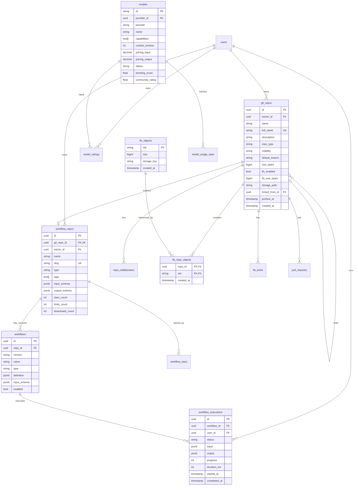

# P1 平台模块设计

> **版本**: v1.0 | **更新**: 2026-01-04
> **范围**: Workflow + Registry + Git
> **目标**: 构建社区生态基础设施

---

## 一、模块概览

### 1.1 模块架构

```
┌─────────────────────────────────────────────────────────────────┐
│                        P1 模块架构                               │
├─────────────────────────────────────────────────────────────────┤
│                                                                  │
│   ┌─────────────────────────────────────────────────────────┐   │
│   │                   Community Layer (P2)                   │   │
│   │              Star │ Fork │ Trending │ Search            │   │
│   └─────────────────────────────────────────────────────────┘   │
│                              │                                   │
│          ┌───────────────────┼───────────────────┐              │
│          ▼                   ▼                   ▼              │
│   ┌────────────┐      ┌────────────┐      ┌────────────┐       │
│   │  Workflow  │      │  Registry  │      │    Git     │       │
│   │            │      │            │      │            │       │
│   │ • 索引管理 │      │ • 模型元数据│      │ • Smart HTTP│      │
│   │ • 执行引擎 │      │ • 搜索筛选 │      │ • LFS API  │       │
│   │ • 版本展示 │      │ • Trending │      │ • 仓库管理  │       │
│   └──────┬─────┘      └────────────┘      └──────┬─────┘       │
│          │                                       │              │
│          └───────────────────┬───────────────────┘              │
│                              ▼                                   │
│   ┌─────────────────────────────────────────────────────────┐   │
│   │                    Storage Layer                         │   │
│   │            PostgreSQL │ Cloudflare R2 + CDN             │   │
│   └─────────────────────────────────────────────────────────┘   │
│                                                                  │
└─────────────────────────────────────────────────────────────────┘
```

### 1.2 模块职责

| 模块 | 核心职责 | 关键能力 |
|------|----------|----------|
| **Workflow** | 工作流仓库索引与执行 | 搜索发现、版本展示、多引擎执行 |
| **Registry** | AI 模型元数据管理 | 模型目录、能力筛选、Trending |
| **Git** | 统一版本管理 | Smart HTTP、LFS 大文件、协作 |

### 1.3 仓库类型

```
┌─────────────────────────────────────────────────────────────────┐
│                        Git 仓库类型                              │
├─────────────────────────────────────────────────────────────────┤
│                                                                  │
│   ┌────────────────┐  ┌────────────────┐  ┌────────────────┐   │
│   │     Code       │  │    Workflow    │  │    Project     │   │
│   │    仓库        │  │     仓库       │  │     仓库       │   │
│   ├────────────────┤  ├────────────────┤  ├────────────────┤   │
│   │ • 代码托管     │  │ • 工作流定义   │  │ • 视频项目     │   │
│   │ • 分支管理     │  │ • 配置文件     │  │ • 时间线数据   │   │
│   │ • PR 协作      │  │ • 资源文件     │  │ • 媒体文件(LFS)│   │
│   ├────────────────┤  ├────────────────┤  ├────────────────┤   │
│   │ LFS: 可选      │  │ LFS: 可选      │  │ LFS: 必须      │   │
│   │ 索引: 无       │  │ 索引: Workflow │  │ 索引: 无       │   │
│   └────────────────┘  └────────────────┘  └────────────────┘   │
│                                                                  │
└─────────────────────────────────────────────────────────────────┘
```

---

## 二、Workflow Module

### 2.1 目录结构

```
internal/module/workflow/
├── handler.go              # HTTP Handler
├── service.go              # 业务逻辑
├── repository.go           # 数据访问
├── model.go                # 数据模型
├── dto.go                  # 请求/响应 DTO
├── search.go               # 搜索服务
├── executor/               # 执行引擎
│   ├── interface.go        # 执行器接口
│   ├── registry.go         # 执行器注册表
│   ├── builtin.go          # 内置执行器
│   ├── n8n.go              # N8n 执行器
│   └── comfyui.go          # ComfyUI 执行器
└── errors.go               # 模块错误
```

### 2.2 数据模型

```go
// model.go

type WorkflowType string

const (
    WorkflowTypeBuiltin  WorkflowType = "builtin"
    WorkflowTypeN8n      WorkflowType = "n8n"
    WorkflowTypeComfyUI  WorkflowType = "comfyui"
    WorkflowTypeCustom   WorkflowType = "custom"
)

type ExecutionStatus string

const (
    ExecutionStatusIdle      ExecutionStatus = "idle"
    ExecutionStatusRunning   ExecutionStatus = "running"
    ExecutionStatusCompleted ExecutionStatus = "completed"
    ExecutionStatusFailed    ExecutionStatus = "failed"
    ExecutionStatusCancelled ExecutionStatus = "cancelled"
)

// WorkflowRepo 工作流仓库索引（元数据）
type WorkflowRepo struct {
    ID             uuid.UUID    `gorm:"type:uuid;primary_key;default:gen_random_uuid()"`
    GitRepoID      uuid.UUID    `gorm:"type:uuid;not null;uniqueIndex"`
    OwnerID        uuid.UUID    `gorm:"type:uuid;not null;index"`
    Name           string       `gorm:"not null"`
    Slug           string       `gorm:"not null;uniqueIndex"`
    Description    string
    Type           WorkflowType `gorm:"not null"`
    Tags           []string     `gorm:"type:text[]"`
    InputSchema    JSONB        `gorm:"type:jsonb"` // JSON Schema
    OutputSchema   JSONB        `gorm:"type:jsonb"`
    Config         JSONB        `gorm:"type:jsonb"` // 执行配置

    // 社区统计
    StarsCount     int          `gorm:"default:0"`
    ForksCount     int          `gorm:"default:0"`
    DownloadsCount int          `gorm:"default:0"`

    // 状态
    Visibility     string       `gorm:"default:public"` // public, private
    Enabled        bool         `gorm:"default:true"`

    CreatedAt      time.Time    `gorm:"autoCreateTime"`
    UpdatedAt      time.Time    `gorm:"autoUpdateTime"`

    // Relations
    GitRepo        *git.GitRepo `gorm:"foreignKey:GitRepoID"`
    Owner          *auth.User   `gorm:"foreignKey:OwnerID"`
}

func (WorkflowRepo) TableName() string { return "workflow_repos" }

// Workflow 工作流定义（从仓库解析）
type Workflow struct {
    ID           uuid.UUID    `gorm:"type:uuid;primary_key;default:gen_random_uuid()"`
    RepoID       uuid.UUID    `gorm:"type:uuid;not null;index"`
    Version      string       `gorm:"not null"` // Git tag or commit
    Name         string       `gorm:"not null"`
    Description  string
    Type         WorkflowType `gorm:"not null"`
    InputSchema  JSONB        `gorm:"type:jsonb"`
    OutputSchema JSONB        `gorm:"type:jsonb"`
    Definition   JSONB        `gorm:"type:jsonb;not null"` // 工作流定义
    Config       JSONB        `gorm:"type:jsonb"`
    Enabled      bool         `gorm:"default:true"`
    CreatedAt    time.Time    `gorm:"autoCreateTime"`
}

func (Workflow) TableName() string { return "workflows" }

// WorkflowExecution 工作流执行记录
type WorkflowExecution struct {
    ID          uuid.UUID       `gorm:"type:uuid;primary_key;default:gen_random_uuid()"`
    WorkflowID  uuid.UUID       `gorm:"type:uuid;not null;index"`
    UserID      uuid.UUID       `gorm:"type:uuid;not null;index"`
    Status      ExecutionStatus `gorm:"not null;default:idle"`
    Input       JSONB           `gorm:"type:jsonb"`
    Output      JSONB           `gorm:"type:jsonb"`
    Error       string
    Progress    int             `gorm:"default:0"` // 0-100
    StartedAt   *time.Time
    CompletedAt *time.Time
    DurationMs  int
    CreatedAt   time.Time       `gorm:"autoCreateTime"`
}

func (WorkflowExecution) TableName() string { return "workflow_executions" }

// WorkflowStar 点赞记录
type WorkflowStar struct {
    UserID     uuid.UUID `gorm:"type:uuid;primaryKey"`
    RepoID     uuid.UUID `gorm:"type:uuid;primaryKey"`
    CreatedAt  time.Time `gorm:"autoCreateTime"`
}

func (WorkflowStar) TableName() string { return "workflow_stars" }

// JSONB helper type
type JSONB map[string]interface{}

func (j JSONB) Value() (driver.Value, error) {
    return json.Marshal(j)
}

func (j *JSONB) Scan(value interface{}) error {
    bytes, ok := value.([]byte)
    if !ok {
        return errors.New("type assertion to []byte failed")
    }
    return json.Unmarshal(bytes, &j)
}
```

### 2.3 执行器设计

```go
// executor/interface.go

// Executor 工作流执行器接口
type Executor interface {
    // Type 返回执行器类型
    Type() WorkflowType

    // Validate 验证工作流定义
    Validate(workflow *Workflow) error

    // Execute 执行工作流
    Execute(ctx context.Context, req *ExecuteRequest) (*ExecuteResult, error)

    // GetStatus 获取执行状态
    GetStatus(ctx context.Context, executionID uuid.UUID) (*ExecutionStatus, error)

    // Cancel 取消执行
    Cancel(ctx context.Context, executionID uuid.UUID) error
}

type ExecuteRequest struct {
    Workflow    *Workflow
    ExecutionID uuid.UUID
    Input       map[string]interface{}
    Config      map[string]interface{}
    Callback    ExecutionCallback // 进度回调
}

type ExecuteResult struct {
    ExecutionID uuid.UUID
    Status      ExecutionStatus
    Output      map[string]interface{}
    Error       string
    DurationMs  int
}

type ExecutionCallback func(progress int, message string)

// executor/registry.go

type ExecutorRegistry struct {
    mu        sync.RWMutex
    executors map[WorkflowType]Executor
}

func NewExecutorRegistry() *ExecutorRegistry {
    return &ExecutorRegistry{
        executors: make(map[WorkflowType]Executor),
    }
}

func (r *ExecutorRegistry) Register(executor Executor) {
    r.mu.Lock()
    defer r.mu.Unlock()
    r.executors[executor.Type()] = executor
}

func (r *ExecutorRegistry) Get(t WorkflowType) (Executor, bool) {
    r.mu.RLock()
    defer r.mu.RUnlock()
    e, ok := r.executors[t]
    return e, ok
}

// executor/builtin.go

type BuiltinExecutor struct {
    logger *zap.Logger
}

func NewBuiltinExecutor(logger *zap.Logger) *BuiltinExecutor {
    return &BuiltinExecutor{logger: logger}
}

func (e *BuiltinExecutor) Type() WorkflowType {
    return WorkflowTypeBuiltin
}

func (e *BuiltinExecutor) Execute(ctx context.Context, req *ExecuteRequest) (*ExecuteResult, error) {
    startTime := time.Now()

    // Parse workflow definition
    def := req.Workflow.Definition

    // Execute steps
    output := make(map[string]interface{})
    steps, _ := def["steps"].([]interface{})

    for i, step := range steps {
        select {
        case <-ctx.Done():
            return &ExecuteResult{
                ExecutionID: req.ExecutionID,
                Status:      ExecutionStatusCancelled,
            }, ctx.Err()
        default:
        }

        progress := int(float64(i+1) / float64(len(steps)) * 100)
        if req.Callback != nil {
            req.Callback(progress, fmt.Sprintf("Executing step %d", i+1))
        }

        // Execute step...
        stepResult, err := e.executeStep(ctx, step, req.Input, output)
        if err != nil {
            return &ExecuteResult{
                ExecutionID: req.ExecutionID,
                Status:      ExecutionStatusFailed,
                Error:       err.Error(),
                DurationMs:  int(time.Since(startTime).Milliseconds()),
            }, nil
        }

        // Merge step result into output
        for k, v := range stepResult {
            output[k] = v
        }
    }

    return &ExecuteResult{
        ExecutionID: req.ExecutionID,
        Status:      ExecutionStatusCompleted,
        Output:      output,
        DurationMs:  int(time.Since(startTime).Milliseconds()),
    }, nil
}
```

### 2.4 核心接口

```go
// service.go

type Service interface {
    // 仓库管理
    CreateRepo(ctx context.Context, userID uuid.UUID, req *CreateRepoRequest) (*WorkflowRepo, error)
    GetRepo(ctx context.Context, slug string) (*WorkflowRepo, error)
    UpdateRepo(ctx context.Context, userID uuid.UUID, slug string, req *UpdateRepoRequest) (*WorkflowRepo, error)
    DeleteRepo(ctx context.Context, userID uuid.UUID, slug string) error
    ListRepos(ctx context.Context, filter *RepoFilter) (*RepoList, error)

    // 搜索发现
    Search(ctx context.Context, query string, filter *SearchFilter) (*SearchResult, error)
    GetTrending(ctx context.Context, period string, limit int) ([]*WorkflowRepo, error)

    // 社区功能
    Star(ctx context.Context, userID uuid.UUID, slug string) error
    Unstar(ctx context.Context, userID uuid.UUID, slug string) error
    Fork(ctx context.Context, userID uuid.UUID, slug string) (*WorkflowRepo, error)
    IsStarred(ctx context.Context, userID uuid.UUID, slug string) (bool, error)

    // 版本管理
    ListVersions(ctx context.Context, slug string) ([]*WorkflowVersion, error)
    GetVersion(ctx context.Context, slug, version string) (*Workflow, error)

    // 执行
    Execute(ctx context.Context, userID uuid.UUID, req *ExecuteWorkflowRequest) (*WorkflowExecution, error)
    GetExecution(ctx context.Context, executionID uuid.UUID) (*WorkflowExecution, error)
    CancelExecution(ctx context.Context, userID uuid.UUID, executionID uuid.UUID) error
    ListExecutions(ctx context.Context, userID uuid.UUID, filter *ExecutionFilter) (*ExecutionList, error)
}

type CreateRepoRequest struct {
    Name        string            `json:"name" binding:"required"`
    Description string            `json:"description"`
    Type        WorkflowType      `json:"type" binding:"required"`
    Tags        []string          `json:"tags"`
    InputSchema map[string]any    `json:"input_schema"`
    Visibility  string            `json:"visibility"` // public, private
}

type SearchFilter struct {
    Type       WorkflowType `form:"type"`
    Tags       []string     `form:"tags"`
    SortBy     string       `form:"sort_by"`     // stars, downloads, updated
    SortOrder  string       `form:"sort_order"`  // asc, desc
    Page       int          `form:"page"`
    PageSize   int          `form:"page_size"`
}

type ExecuteWorkflowRequest struct {
    Slug    string                 `json:"slug" binding:"required"`
    Version string                 `json:"version"` // 默认最新版本
    Input   map[string]interface{} `json:"input"`
    Async   bool                   `json:"async"` // 异步执行
}
```

### 2.5 API 接口

```yaml
# Workflow Repo API

GET /api/v1/workflows:
  description: 列出工作流仓库
  query:
    type: builtin | n8n | comfyui | custom
    tags: string[] (comma-separated)
    sort_by: stars | downloads | updated
    page: int
    page_size: int
  response:
    items: WorkflowRepo[]
    total: int
    page: int

POST /api/v1/workflows:
  description: 创建工作流仓库
  request:
    name: string
    description: string
    type: WorkflowType
    tags: string[]
    input_schema: object
    visibility: public | private
  response:
    WorkflowRepo

GET /api/v1/workflows/{slug}:
  description: 获取工作流详情
  response:
    WorkflowRepo with versions

DELETE /api/v1/workflows/{slug}:
  description: 删除工作流仓库

GET /api/v1/workflows/trending:
  description: 热门工作流
  query:
    period: day | week | month
    limit: int
  response:
    items: WorkflowRepo[]

GET /api/v1/workflows/search:
  description: 搜索工作流
  query:
    q: string
    type: WorkflowType
    tags: string[]
  response:
    items: WorkflowRepo[]
    total: int

# Star & Fork

POST /api/v1/workflows/{slug}/star:
  description: 点赞工作流

DELETE /api/v1/workflows/{slug}/star:
  description: 取消点赞

POST /api/v1/workflows/{slug}/fork:
  description: Fork 工作流
  response:
    WorkflowRepo

# Versions

GET /api/v1/workflows/{slug}/versions:
  description: 列出版本
  response:
    items:
      - version: string
        created_at: timestamp
        commit: string

GET /api/v1/workflows/{slug}/versions/{version}:
  description: 获取指定版本
  response:
    Workflow

# Execution

POST /api/v1/workflows/execute:
  description: 执行工作流
  request:
    slug: string
    version: string (optional)
    input: object
    async: bool
  response:
    execution_id: uuid
    status: ExecutionStatus
    output: object (if sync)

GET /api/v1/workflows/executions/{id}:
  description: 获取执行状态
  response:
    id: uuid
    workflow_id: uuid
    status: ExecutionStatus
    progress: int
    output: object
    error: string
    started_at: timestamp
    completed_at: timestamp

DELETE /api/v1/workflows/executions/{id}:
  description: 取消执行

GET /api/v1/workflows/executions:
  description: 列出执行记录
  query:
    status: ExecutionStatus
    page: int
  response:
    items: WorkflowExecution[]
    total: int
```

---

## 三、Registry Module

### 3.1 目录结构

```
internal/module/registry/
├── handler.go              # HTTP Handler
├── service.go              # 业务逻辑
├── repository.go           # 数据访问
├── model.go                # 数据模型
├── dto.go                  # 请求/响应 DTO
├── trending.go             # Trending 算法
└── sync.go                 # 模型同步（从提供商获取）
```

### 3.2 数据模型

```go
// model.go

type ModelStatus string

const (
    ModelStatusActive     ModelStatus = "active"
    ModelStatusDeprecated ModelStatus = "deprecated"
    ModelStatusPreview    ModelStatus = "preview"
)

// Model 模型元数据
type Model struct {
    ID              string      `gorm:"primaryKey"` // provider/model-name
    ProviderID      uuid.UUID   `gorm:"type:uuid;not null;index"`
    Provider        string      `gorm:"not null;index"` // openai, anthropic, ...
    Name            string      `gorm:"not null"`
    DisplayName     string      `gorm:"not null"`
    Description     string
    Capabilities    []string    `gorm:"type:text[];not null"` // chat, vision, tools, image
    ContextWindow   int         `gorm:"not null"`
    MaxOutputTokens int         `gorm:"not null"`
    PricingInput    float64     `gorm:"type:decimal(10,6)"` // $ per 1M tokens
    PricingOutput   float64     `gorm:"type:decimal(10,6)"`
    Status          ModelStatus `gorm:"not null;default:active"`

    // 社区数据
    UsageCount      int64       `gorm:"default:0"`
    CommunityRating float64     `gorm:"type:decimal(2,1);default:0"` // 1-5
    RatingCount     int         `gorm:"default:0"`

    // Trending 数据
    TrendingScore   float64     `gorm:"type:decimal(10,4);default:0"`
    LastTrendingAt  time.Time

    CreatedAt       time.Time   `gorm:"autoCreateTime"`
    UpdatedAt       time.Time   `gorm:"autoUpdateTime"`
}

func (Model) TableName() string { return "models" }

// ModelRating 模型评分
type ModelRating struct {
    ID        uuid.UUID `gorm:"type:uuid;primary_key;default:gen_random_uuid()"`
    ModelID   string    `gorm:"not null;index"`
    UserID    uuid.UUID `gorm:"type:uuid;not null;index"`
    Rating    int       `gorm:"not null"` // 1-5
    Comment   string
    CreatedAt time.Time `gorm:"autoCreateTime"`
    UpdatedAt time.Time `gorm:"autoUpdateTime"`
}

func (ModelRating) TableName() string { return "model_ratings" }

// ModelUsageStats 模型使用统计（定时聚合）
type ModelUsageStats struct {
    ModelID       string    `gorm:"primaryKey"`
    Date          time.Time `gorm:"primaryKey;type:date"`
    RequestCount  int64     `gorm:"not null"`
    TokensUsed    int64     `gorm:"not null"`
    UniqueUsers   int       `gorm:"not null"`
}

func (ModelUsageStats) TableName() string { return "model_usage_stats" }
```

### 3.3 Trending 算法

```go
// trending.go

type TrendingCalculator struct {
    repo   Repository
    logger *zap.Logger
}

// TrendingWeights Trending 计算权重
type TrendingWeights struct {
    RecentUsage   float64 // 近期使用量
    GrowthRate    float64 // 增长率
    QualityScore  float64 // 质量分
    Freshness     float64 // 新鲜度
}

var DefaultTrendingWeights = TrendingWeights{
    RecentUsage:  0.4,
    GrowthRate:   0.3,
    QualityScore: 0.2,
    Freshness:    0.1,
}

func (c *TrendingCalculator) Calculate(ctx context.Context) error {
    models, err := c.repo.ListModels(ctx, nil)
    if err != nil {
        return err
    }

    now := time.Now()
    weekAgo := now.AddDate(0, 0, -7)
    twoWeeksAgo := now.AddDate(0, 0, -14)

    for _, model := range models {
        // 1. 近期使用量（归一化）
        thisWeekUsage, _ := c.repo.GetUsageCount(ctx, model.ID, weekAgo, now)
        lastWeekUsage, _ := c.repo.GetUsageCount(ctx, model.ID, twoWeeksAgo, weekAgo)

        // 2. 增长率
        var growthRate float64
        if lastWeekUsage > 0 {
            growthRate = float64(thisWeekUsage-lastWeekUsage) / float64(lastWeekUsage)
        } else if thisWeekUsage > 0 {
            growthRate = 1.0 // 从 0 到有使用量，视为 100% 增长
        }

        // 3. 质量分（评分 × 评分数开方）
        qualityScore := model.CommunityRating * math.Sqrt(float64(model.RatingCount))

        // 4. 新鲜度（30 天内的新模型加成）
        daysSinceCreated := now.Sub(model.CreatedAt).Hours() / 24
        freshness := 1.0 / (1.0 + daysSinceCreated/30)

        // 计算综合分数
        score := DefaultTrendingWeights.RecentUsage*float64(thisWeekUsage) +
            DefaultTrendingWeights.GrowthRate*growthRate*100 +
            DefaultTrendingWeights.QualityScore*qualityScore +
            DefaultTrendingWeights.Freshness*freshness*10

        // 更新 Trending 分数
        if err := c.repo.UpdateTrendingScore(ctx, model.ID, score); err != nil {
            c.logger.Error("failed to update trending score",
                zap.String("model", model.ID),
                zap.Error(err),
            )
        }
    }

    return nil
}
```

### 3.4 核心接口

```go
// service.go

type Service interface {
    // 模型查询
    GetModel(ctx context.Context, id string) (*Model, error)
    ListModels(ctx context.Context, filter *ModelFilter) (*ModelList, error)
    SearchModels(ctx context.Context, query string, filter *ModelFilter) (*ModelList, error)

    // Trending
    GetTrending(ctx context.Context, limit int) ([]*Model, error)
    RefreshTrending(ctx context.Context) error

    // 比较
    CompareModels(ctx context.Context, modelIDs []string) (*CompareResult, error)

    // 评分
    RateModel(ctx context.Context, userID uuid.UUID, modelID string, rating int, comment string) error
    GetRatings(ctx context.Context, modelID string, page, pageSize int) (*RatingList, error)

    // 同步（管理员）
    SyncModels(ctx context.Context) error
}

type ModelFilter struct {
    Provider     string   `form:"provider"`
    Capabilities []string `form:"capabilities"`
    Status       string   `form:"status"`
    MinContext   int      `form:"min_context"`
    MaxPriceIn   float64  `form:"max_price_in"`   // 最大输入价格
    MaxPriceOut  float64  `form:"max_price_out"`  // 最大输出价格
    SortBy       string   `form:"sort_by"`        // trending, price, context, rating
    SortOrder    string   `form:"sort_order"`     // asc, desc
    Page         int      `form:"page"`
    PageSize     int      `form:"page_size"`
}

type CompareResult struct {
    Models []*ModelComparison `json:"models"`
}

type ModelComparison struct {
    Model         *Model             `json:"model"`
    Strengths     []string           `json:"strengths"`
    Weaknesses    []string           `json:"weaknesses"`
    BestFor       []string           `json:"best_for"`
    PricePerQuery float64            `json:"price_per_query"` // 估算每次请求成本
}
```

### 3.5 API 接口

```yaml
GET /api/v1/models:
  description: 列出模型
  query:
    provider: string
    capabilities: string[] (comma-separated)
    status: active | deprecated | preview
    min_context: int
    max_price_in: float
    sort_by: trending | price | context | rating
    page: int
    page_size: int
  response:
    items: Model[]
    total: int

GET /api/v1/models/{id}:
  description: 获取模型详情
  response:
    Model with ratings summary

GET /api/v1/models/trending:
  description: 热门模型
  query:
    limit: int
  response:
    items: Model[]

GET /api/v1/models/search:
  description: 搜索模型
  query:
    q: string
    provider: string
    capabilities: string[]
  response:
    items: Model[]
    total: int

GET /api/v1/models/compare:
  description: 模型对比
  query:
    ids: string[] (comma-separated)
  response:
    models: ModelComparison[]

POST /api/v1/models/{id}/rate:
  description: 评分模型
  request:
    rating: int (1-5)
    comment: string (optional)

GET /api/v1/models/{id}/ratings:
  description: 获取评分列表
  query:
    page: int
    page_size: int
  response:
    items: ModelRating[]
    total: int
    average: float
```

---

## 四、Git Module

### 4.1 目录结构

```
internal/module/git/
├── handler.go              # HTTP Handler
├── service.go              # 业务逻辑
├── repository.go           # 数据访问
├── model.go                # 数据模型
├── dto.go                  # 请求/响应 DTO
├── protocol/               # Git 协议
│   ├── smart_http.go       # Smart HTTP 处理
│   ├── pack.go             # Pack 文件处理
│   └── refs.go             # 引用管理
├── lfs/                    # LFS 子模块
│   ├── handler.go          # LFS API Handler
│   ├── batch.go            # Batch API
│   ├── storage.go          # R2 存储
│   └── lock.go             # 文件锁定
├── storage.go              # 仓库存储管理
└── errors.go               # 模块错误
```

### 4.2 数据模型

```go
// model.go

type RepoType string

const (
    RepoTypeCode     RepoType = "code"
    RepoTypeWorkflow RepoType = "workflow"
    RepoTypeProject  RepoType = "project"
)

type Visibility string

const (
    VisibilityPublic  Visibility = "public"
    VisibilityPrivate Visibility = "private"
)

// GitRepo Git 仓库
type GitRepo struct {
    ID            uuid.UUID   `gorm:"type:uuid;primary_key;default:gen_random_uuid()"`
    OwnerID       uuid.UUID   `gorm:"type:uuid;not null;index"`
    Name          string      `gorm:"not null"`
    FullName      string      `gorm:"not null;uniqueIndex"` // owner/name
    Description   string
    RepoType      RepoType    `gorm:"not null;default:code"`
    Visibility    Visibility  `gorm:"not null;default:public"`
    DefaultBranch string      `gorm:"default:main"`
    SizeBytes     int64       `gorm:"default:0"`
    LFSEnabled    bool        `gorm:"default:false"`
    LFSSizeBytes  int64       `gorm:"default:0"`
    StoragePath   string      `gorm:"not null"` // 物理存储路径

    // 统计
    StarsCount    int         `gorm:"default:0"`
    ForksCount    int         `gorm:"default:0"`

    // 元数据
    ForkedFromID  *uuid.UUID  `gorm:"type:uuid;index"`

    PushedAt      *time.Time
    CreatedAt     time.Time   `gorm:"autoCreateTime"`
    UpdatedAt     time.Time   `gorm:"autoUpdateTime"`

    // Relations
    Owner         *auth.User  `gorm:"foreignKey:OwnerID"`
    ForkedFrom    *GitRepo    `gorm:"foreignKey:ForkedFromID"`
    Collaborators []RepoCollaborator `gorm:"foreignKey:RepoID"`
}

func (GitRepo) TableName() string { return "git_repos" }

// RepoCollaborator 协作者
type RepoCollaborator struct {
    RepoID      uuid.UUID `gorm:"type:uuid;primaryKey"`
    UserID      uuid.UUID `gorm:"type:uuid;primaryKey"`
    Permission  string    `gorm:"not null"` // read, write, admin
    CreatedAt   time.Time `gorm:"autoCreateTime"`
}

func (RepoCollaborator) TableName() string { return "repo_collaborators" }

// LFSObject LFS 对象
type LFSObject struct {
    OID         string    `gorm:"primaryKey"` // SHA-256 hash
    Size        int64     `gorm:"not null"`
    StorageKey  string    `gorm:"not null"` // R2 key
    ContentType string
    CreatedAt   time.Time `gorm:"autoCreateTime"`
}

func (LFSObject) TableName() string { return "lfs_objects" }

// LFSRepoObject 仓库-LFS 对象关联
type LFSRepoObject struct {
    RepoID    uuid.UUID `gorm:"type:uuid;primaryKey"`
    OID       string    `gorm:"primaryKey"`
    CreatedAt time.Time `gorm:"autoCreateTime"`
}

func (LFSRepoObject) TableName() string { return "lfs_repo_objects" }

// LFSLock LFS 文件锁
type LFSLock struct {
    ID        uuid.UUID `gorm:"type:uuid;primary_key;default:gen_random_uuid()"`
    RepoID    uuid.UUID `gorm:"type:uuid;not null;index"`
    Path      string    `gorm:"not null"`
    OwnerID   uuid.UUID `gorm:"type:uuid;not null"`
    LockedAt  time.Time `gorm:"autoCreateTime"`
}

func (LFSLock) TableName() string { return "lfs_locks" }

// PullRequest Pull Request
type PullRequest struct {
    ID           uuid.UUID `gorm:"type:uuid;primary_key;default:gen_random_uuid()"`
    RepoID       uuid.UUID `gorm:"type:uuid;not null;index"`
    Number       int       `gorm:"not null"`
    Title        string    `gorm:"not null"`
    Body         string
    SourceBranch string    `gorm:"not null"`
    TargetBranch string    `gorm:"not null"`
    Status       string    `gorm:"not null;default:open"` // open, merged, closed
    AuthorID     uuid.UUID `gorm:"type:uuid;not null"`
    MergedAt     *time.Time
    MergedBy     *uuid.UUID `gorm:"type:uuid"`
    CreatedAt    time.Time  `gorm:"autoCreateTime"`
    UpdatedAt    time.Time  `gorm:"autoUpdateTime"`
}

func (PullRequest) TableName() string { return "pull_requests" }
```

### 4.3 Git Smart HTTP 协议

```go
// protocol/smart_http.go

type SmartHTTPHandler struct {
    service Service
    storage StorageManager
    logger  *zap.Logger
}

func NewSmartHTTPHandler(service Service, storage StorageManager, logger *zap.Logger) *SmartHTTPHandler {
    return &SmartHTTPHandler{
        service: service,
        storage: storage,
        logger:  logger,
    }
}

// InfoRefs GET /{owner}/{repo}/info/refs
func (h *SmartHTTPHandler) InfoRefs(c *gin.Context) {
    owner := c.Param("owner")
    name := c.Param("repo")
    serviceName := c.Query("service")

    // 验证 service 参数
    if serviceName != "git-upload-pack" && serviceName != "git-receive-pack" {
        c.String(http.StatusBadRequest, "Invalid service")
        return
    }

    // 获取仓库
    repo, err := h.service.GetRepo(c.Request.Context(), owner, name)
    if err != nil {
        c.String(http.StatusNotFound, "Repository not found")
        return
    }

    // 权限检查
    user := getUserFromContext(c)
    if !h.checkAccess(repo, user, serviceName) {
        c.String(http.StatusForbidden, "Access denied")
        return
    }

    // 获取仓库路径
    repoPath := h.storage.GetRepoPath(repo.StoragePath)

    // 执行 git 命令
    cmd := exec.CommandContext(c.Request.Context(), "git", serviceName, "--stateless-rpc", "--advertise-refs", repoPath)
    output, err := cmd.Output()
    if err != nil {
        h.logger.Error("git command failed", zap.Error(err))
        c.String(http.StatusInternalServerError, "Internal error")
        return
    }

    // 写入响应
    c.Header("Content-Type", fmt.Sprintf("application/x-%s-advertisement", serviceName))
    c.Header("Cache-Control", "no-cache")

    // 写入服务声明
    pktLine := fmt.Sprintf("# service=%s\n", serviceName)
    c.Writer.Write(packetLine(pktLine))
    c.Writer.Write([]byte("0000"))
    c.Writer.Write(output)
}

// UploadPack POST /{owner}/{repo}/git-upload-pack
func (h *SmartHTTPHandler) UploadPack(c *gin.Context) {
    h.handleService(c, "git-upload-pack")
}

// ReceivePack POST /{owner}/{repo}/git-receive-pack
func (h *SmartHTTPHandler) ReceivePack(c *gin.Context) {
    h.handleService(c, "git-receive-pack")
}

func (h *SmartHTTPHandler) handleService(c *gin.Context, serviceName string) {
    owner := c.Param("owner")
    name := c.Param("repo")

    repo, err := h.service.GetRepo(c.Request.Context(), owner, name)
    if err != nil {
        c.String(http.StatusNotFound, "Repository not found")
        return
    }

    user := getUserFromContext(c)
    if !h.checkAccess(repo, user, serviceName) {
        c.String(http.StatusForbidden, "Access denied")
        return
    }

    repoPath := h.storage.GetRepoPath(repo.StoragePath)

    cmd := exec.CommandContext(c.Request.Context(), "git", serviceName, "--stateless-rpc", repoPath)
    cmd.Stdin = c.Request.Body
    cmd.Stdout = c.Writer

    c.Header("Content-Type", fmt.Sprintf("application/x-%s-result", serviceName))
    c.Header("Cache-Control", "no-cache")

    if err := cmd.Run(); err != nil {
        h.logger.Error("git command failed", zap.Error(err))
    }

    // 更新 pushed_at
    if serviceName == "git-receive-pack" {
        h.service.UpdatePushedAt(c.Request.Context(), repo.ID)
    }
}

func packetLine(line string) []byte {
    length := len(line) + 4
    return []byte(fmt.Sprintf("%04x%s", length, line))
}
```

### 4.4 LFS Batch API

```go
// lfs/batch.go

type BatchHandler struct {
    service     Service
    storage     LFSStorage
    presigner   Presigner
    logger      *zap.Logger
}

type BatchRequest struct {
    Operation string        `json:"operation"` // download, upload
    Transfers []string      `json:"transfers"` // basic
    Objects   []BatchObject `json:"objects"`
}

type BatchObject struct {
    OID  string `json:"oid"`
    Size int64  `json:"size"`
}

type BatchResponse struct {
    Transfer string              `json:"transfer"`
    Objects  []BatchObjectResult `json:"objects"`
}

type BatchObjectResult struct {
    OID     string                 `json:"oid"`
    Size    int64                  `json:"size"`
    Actions map[string]BatchAction `json:"actions,omitempty"`
    Error   *BatchError            `json:"error,omitempty"`
}

type BatchAction struct {
    Href      string            `json:"href"`
    Header    map[string]string `json:"header,omitempty"`
    ExpiresIn int               `json:"expires_in"` // seconds
}

type BatchError struct {
    Code    int    `json:"code"`
    Message string `json:"message"`
}

// HandleBatch POST /{owner}/{repo}/info/lfs/objects/batch
func (h *BatchHandler) HandleBatch(c *gin.Context) {
    owner := c.Param("owner")
    name := c.Param("repo")

    repo, err := h.service.GetRepo(c.Request.Context(), owner, name)
    if err != nil {
        c.JSON(http.StatusNotFound, gin.H{"error": "Repository not found"})
        return
    }

    var req BatchRequest
    if err := c.ShouldBindJSON(&req); err != nil {
        c.JSON(http.StatusBadRequest, gin.H{"error": err.Error()})
        return
    }

    // 权限检查
    user := getUserFromContext(c)
    if req.Operation == "upload" && !h.checkWriteAccess(repo, user) {
        c.JSON(http.StatusForbidden, gin.H{"error": "Write access required"})
        return
    }

    response := &BatchResponse{
        Transfer: "basic",
        Objects:  make([]BatchObjectResult, 0, len(req.Objects)),
    }

    for _, obj := range req.Objects {
        result := BatchObjectResult{
            OID:  obj.OID,
            Size: obj.Size,
        }

        switch req.Operation {
        case "download":
            result.Actions = h.getDownloadActions(c.Request.Context(), repo, &obj)
        case "upload":
            result.Actions, result.Error = h.getUploadActions(c.Request.Context(), repo, user, &obj)
        }

        response.Objects = append(response.Objects, result)
    }

    c.JSON(http.StatusOK, response)
}

func (h *BatchHandler) getDownloadActions(ctx context.Context, repo *GitRepo, obj *BatchObject) map[string]BatchAction {
    // 检查对象是否存在
    lfsObj, err := h.service.GetLFSObject(ctx, obj.OID)
    if err != nil {
        return nil
    }

    // 生成预签名下载 URL（通过 CDN）
    url, err := h.presigner.PresignDownload(ctx, lfsObj.StorageKey, 1*time.Hour)
    if err != nil {
        h.logger.Error("failed to presign download", zap.Error(err))
        return nil
    }

    return map[string]BatchAction{
        "download": {
            Href:      url,
            ExpiresIn: 3600,
        },
    }
}

func (h *BatchHandler) getUploadActions(ctx context.Context, repo *GitRepo, user *auth.User, obj *BatchObject) (map[string]BatchAction, *BatchError) {
    // 检查配额
    if err := h.checkQuota(ctx, user, obj.Size); err != nil {
        return nil, &BatchError{Code: 507, Message: "Storage quota exceeded"}
    }

    // 检查对象是否已存在
    exists, err := h.service.LFSObjectExists(ctx, obj.OID)
    if err != nil {
        return nil, &BatchError{Code: 500, Message: "Internal error"}
    }

    if exists {
        // 对象已存在，只需创建关联
        h.service.LinkLFSObject(ctx, repo.ID, obj.OID)
        return nil, nil // 空 actions 表示不需要上传
    }

    // 生成预签名上传 URL
    storageKey := fmt.Sprintf("lfs/%s/%s", obj.OID[:2], obj.OID)
    url, err := h.presigner.PresignUpload(ctx, storageKey, obj.Size, 1*time.Hour)
    if err != nil {
        return nil, &BatchError{Code: 500, Message: "Failed to generate upload URL"}
    }

    // 生成验证回调 URL
    verifyURL := fmt.Sprintf("/api/v1/repos/%s/%s/info/lfs/objects/%s/verify",
        repo.Owner.Name, repo.Name, obj.OID)

    return map[string]BatchAction{
        "upload": {
            Href:      url,
            ExpiresIn: 3600,
        },
        "verify": {
            Href:      verifyURL,
            ExpiresIn: 3600,
        },
    }, nil
}
```

### 4.5 LFS 存储设计

```go
// lfs/storage.go

type LFSStorage interface {
    // 上传
    PresignUpload(ctx context.Context, key string, size int64, expires time.Duration) (string, error)

    // 下载
    PresignDownload(ctx context.Context, key string, expires time.Duration) (string, error)

    // 删除
    Delete(ctx context.Context, key string) error

    // 检查存在
    Exists(ctx context.Context, key string) (bool, error)
}

// R2Storage Cloudflare R2 实现
type R2Storage struct {
    client     *s3.Client
    bucket     string
    cdnBaseURL string // CDN URL for downloads
}

func NewR2Storage(cfg *config.R2Config) (*R2Storage, error) {
    // 创建 R2 客户端
    resolver := aws.EndpointResolverWithOptionsFunc(func(service, region string, options ...interface{}) (aws.Endpoint, error) {
        return aws.Endpoint{
            URL: fmt.Sprintf("https://%s.r2.cloudflarestorage.com", cfg.AccountID),
        }, nil
    })

    awsCfg, err := awsconfig.LoadDefaultConfig(context.Background(),
        awsconfig.WithEndpointResolverWithOptions(resolver),
        awsconfig.WithCredentialsProvider(credentials.NewStaticCredentialsProvider(
            cfg.AccessKeyID,
            cfg.SecretAccessKey,
            "",
        )),
        awsconfig.WithRegion("auto"),
    )
    if err != nil {
        return nil, err
    }

    client := s3.NewFromConfig(awsCfg)

    return &R2Storage{
        client:     client,
        bucket:     cfg.Bucket,
        cdnBaseURL: cfg.CDNBaseURL,
    }, nil
}

func (s *R2Storage) PresignUpload(ctx context.Context, key string, size int64, expires time.Duration) (string, error) {
    presigner := s3.NewPresignClient(s.client)

    req, err := presigner.PresignPutObject(ctx, &s3.PutObjectInput{
        Bucket:        aws.String(s.bucket),
        Key:           aws.String(key),
        ContentLength: aws.Int64(size),
    }, func(opts *s3.PresignOptions) {
        opts.Expires = expires
    })
    if err != nil {
        return "", err
    }

    return req.URL, nil
}

func (s *R2Storage) PresignDownload(ctx context.Context, key string, expires time.Duration) (string, error) {
    // 如果配置了 CDN，使用 CDN URL
    if s.cdnBaseURL != "" {
        // 生成签名 URL（Cloudflare signed URLs）
        return s.generateCDNURL(key, expires)
    }

    // 否则使用 R2 预签名
    presigner := s3.NewPresignClient(s.client)
    req, err := presigner.PresignGetObject(ctx, &s3.GetObjectInput{
        Bucket: aws.String(s.bucket),
        Key:    aws.String(key),
    }, func(opts *s3.PresignOptions) {
        opts.Expires = expires
    })
    if err != nil {
        return "", err
    }

    return req.URL, nil
}

func (s *R2Storage) generateCDNURL(key string, expires time.Duration) (string, error) {
    // 生成 Cloudflare 签名 URL
    expiresAt := time.Now().Add(expires).Unix()
    path := "/" + key

    // 签名格式：HMAC-SHA256(path + expires)
    // 实际实现需要配置 Cloudflare Worker 或 Signed URLs
    return fmt.Sprintf("%s%s?expires=%d", s.cdnBaseURL, path, expiresAt), nil
}
```

### 4.6 核心接口

```go
// service.go

type Service interface {
    // 仓库管理
    CreateRepo(ctx context.Context, userID uuid.UUID, req *CreateRepoRequest) (*GitRepo, error)
    GetRepo(ctx context.Context, owner, name string) (*GitRepo, error)
    GetRepoByID(ctx context.Context, id uuid.UUID) (*GitRepo, error)
    UpdateRepo(ctx context.Context, userID uuid.UUID, owner, name string, req *UpdateRepoRequest) (*GitRepo, error)
    DeleteRepo(ctx context.Context, userID uuid.UUID, owner, name string) error
    ListRepos(ctx context.Context, userID uuid.UUID, filter *RepoFilter) (*RepoList, error)
    ForkRepo(ctx context.Context, userID uuid.UUID, owner, name string) (*GitRepo, error)

    // 分支管理
    ListBranches(ctx context.Context, owner, name string) ([]*Branch, error)
    GetBranch(ctx context.Context, owner, name, branch string) (*Branch, error)
    SetDefaultBranch(ctx context.Context, userID uuid.UUID, owner, name, branch string) error

    // 提交历史
    ListCommits(ctx context.Context, owner, name string, filter *CommitFilter) ([]*Commit, error)
    GetCommit(ctx context.Context, owner, name, sha string) (*Commit, error)

    // Pull Request
    CreatePR(ctx context.Context, userID uuid.UUID, owner, name string, req *CreatePRRequest) (*PullRequest, error)
    GetPR(ctx context.Context, owner, name string, number int) (*PullRequest, error)
    ListPRs(ctx context.Context, owner, name string, filter *PRFilter) ([]*PullRequest, error)
    MergePR(ctx context.Context, userID uuid.UUID, owner, name string, number int) error
    ClosePR(ctx context.Context, userID uuid.UUID, owner, name string, number int) error

    // 协作者
    AddCollaborator(ctx context.Context, userID uuid.UUID, owner, name string, collaboratorID uuid.UUID, permission string) error
    RemoveCollaborator(ctx context.Context, userID uuid.UUID, owner, name string, collaboratorID uuid.UUID) error
    ListCollaborators(ctx context.Context, owner, name string) ([]*Collaborator, error)

    // LFS
    GetLFSObject(ctx context.Context, oid string) (*LFSObject, error)
    CreateLFSObject(ctx context.Context, obj *LFSObject) error
    LinkLFSObject(ctx context.Context, repoID uuid.UUID, oid string) error
    LFSObjectExists(ctx context.Context, oid string) (bool, error)

    // LFS Locks
    CreateLock(ctx context.Context, userID uuid.UUID, repoID uuid.UUID, path string) (*LFSLock, error)
    DeleteLock(ctx context.Context, userID uuid.UUID, lockID uuid.UUID, force bool) error
    ListLocks(ctx context.Context, repoID uuid.UUID, path string) ([]*LFSLock, error)

    // 配额
    GetStorageUsage(ctx context.Context, userID uuid.UUID) (*StorageUsage, error)

    // 内部
    UpdatePushedAt(ctx context.Context, repoID uuid.UUID) error
}

type CreateRepoRequest struct {
    Name          string     `json:"name" binding:"required"`
    Description   string     `json:"description"`
    RepoType      RepoType   `json:"repo_type"`
    Visibility    Visibility `json:"visibility"`
    DefaultBranch string     `json:"default_branch"`
    LFSEnabled    bool       `json:"lfs_enabled"`
    InitReadme    bool       `json:"init_readme"`
}

type StorageUsage struct {
    RepoCount     int   `json:"repo_count"`
    GitSizeBytes  int64 `json:"git_size_bytes"`
    LFSSizeBytes  int64 `json:"lfs_size_bytes"`
    TotalBytes    int64 `json:"total_bytes"`
    QuotaBytes    int64 `json:"quota_bytes"`
    RemainingBytes int64 `json:"remaining_bytes"`
}
```

### 4.7 API 接口

```yaml
# Repository API

GET /api/v1/repos:
  description: 列出仓库
  query:
    type: code | workflow | project
    visibility: public | private
    page: int
  response:
    items: GitRepo[]
    total: int

POST /api/v1/repos:
  description: 创建仓库
  request:
    name: string
    description: string
    repo_type: RepoType
    visibility: public | private
    lfs_enabled: bool
    init_readme: bool
  response:
    GitRepo

GET /api/v1/repos/{owner}/{repo}:
  description: 获取仓库详情
  response:
    GitRepo

PATCH /api/v1/repos/{owner}/{repo}:
  description: 更新仓库
  request:
    description: string
    visibility: string
    default_branch: string

DELETE /api/v1/repos/{owner}/{repo}:
  description: 删除仓库

POST /api/v1/repos/{owner}/{repo}/fork:
  description: Fork 仓库
  response:
    GitRepo

# Branches

GET /api/v1/repos/{owner}/{repo}/branches:
  description: 列出分支
  response:
    items: Branch[]

GET /api/v1/repos/{owner}/{repo}/branches/{branch}:
  description: 获取分支详情

# Commits

GET /api/v1/repos/{owner}/{repo}/commits:
  description: 提交历史
  query:
    sha: string (branch or commit)
    page: int
  response:
    items: Commit[]

# Pull Requests

GET /api/v1/repos/{owner}/{repo}/pulls:
  description: 列出 PR
  query:
    state: open | closed | merged | all
  response:
    items: PullRequest[]

POST /api/v1/repos/{owner}/{repo}/pulls:
  description: 创建 PR
  request:
    title: string
    body: string
    source_branch: string
    target_branch: string
  response:
    PullRequest

POST /api/v1/repos/{owner}/{repo}/pulls/{number}/merge:
  description: 合并 PR

# Collaborators

GET /api/v1/repos/{owner}/{repo}/collaborators:
  description: 列出协作者

POST /api/v1/repos/{owner}/{repo}/collaborators:
  description: 添加协作者
  request:
    user_id: uuid
    permission: read | write | admin

DELETE /api/v1/repos/{owner}/{repo}/collaborators/{user_id}:
  description: 移除协作者

# Git Smart HTTP

GET /api/v1/git/{owner}/{repo}/info/refs:
  description: Git refs 广告

POST /api/v1/git/{owner}/{repo}/git-upload-pack:
  description: Git clone/fetch

POST /api/v1/git/{owner}/{repo}/git-receive-pack:
  description: Git push

# LFS

POST /api/v1/repos/{owner}/{repo}/info/lfs/objects/batch:
  description: LFS Batch API
  request:
    operation: download | upload
    objects:
      - oid: string
        size: int
  response:
    transfer: basic
    objects:
      - oid: string
        size: int
        actions:
          download:
            href: string (presigned URL)
            expires_in: int

POST /api/v1/repos/{owner}/{repo}/info/lfs/locks:
  description: 创建 LFS 锁
  request:
    path: string
  response:
    LFSLock

GET /api/v1/repos/{owner}/{repo}/info/lfs/locks:
  description: 列出 LFS 锁
  query:
    path: string

DELETE /api/v1/repos/{owner}/{repo}/info/lfs/locks/{id}:
  description: 删除 LFS 锁
  query:
    force: bool
```

---

## 五、数据库设计

### 5.1 ER 图



### 5.2 迁移文件

```sql
-- migrations/000010_create_git_repos.up.sql

CREATE TABLE git_repos (
    id UUID PRIMARY KEY DEFAULT gen_random_uuid(),
    owner_id UUID NOT NULL REFERENCES users(id) ON DELETE CASCADE,
    name VARCHAR(255) NOT NULL,
    full_name VARCHAR(512) NOT NULL UNIQUE,
    description TEXT,
    repo_type VARCHAR(50) NOT NULL DEFAULT 'code',
    visibility VARCHAR(50) NOT NULL DEFAULT 'public',
    default_branch VARCHAR(255) DEFAULT 'main',
    size_bytes BIGINT DEFAULT 0,
    lfs_enabled BOOLEAN DEFAULT false,
    lfs_size_bytes BIGINT DEFAULT 0,
    storage_path VARCHAR(512) NOT NULL,
    stars_count INT DEFAULT 0,
    forks_count INT DEFAULT 0,
    forked_from_id UUID REFERENCES git_repos(id) ON DELETE SET NULL,
    pushed_at TIMESTAMPTZ,
    created_at TIMESTAMPTZ NOT NULL DEFAULT NOW(),
    updated_at TIMESTAMPTZ NOT NULL DEFAULT NOW()
);

CREATE INDEX idx_git_repos_owner ON git_repos(owner_id);
CREATE INDEX idx_git_repos_type ON git_repos(repo_type);
CREATE INDEX idx_git_repos_visibility ON git_repos(visibility);
CREATE INDEX idx_git_repos_forked_from ON git_repos(forked_from_id);

-- migrations/000011_create_repo_collaborators.up.sql

CREATE TABLE repo_collaborators (
    repo_id UUID NOT NULL REFERENCES git_repos(id) ON DELETE CASCADE,
    user_id UUID NOT NULL REFERENCES users(id) ON DELETE CASCADE,
    permission VARCHAR(50) NOT NULL,
    created_at TIMESTAMPTZ NOT NULL DEFAULT NOW(),
    PRIMARY KEY (repo_id, user_id)
);

-- migrations/000012_create_lfs_objects.up.sql

CREATE TABLE lfs_objects (
    oid VARCHAR(64) PRIMARY KEY,
    size BIGINT NOT NULL,
    storage_key VARCHAR(512) NOT NULL,
    content_type VARCHAR(255),
    created_at TIMESTAMPTZ NOT NULL DEFAULT NOW()
);

CREATE TABLE lfs_repo_objects (
    repo_id UUID NOT NULL REFERENCES git_repos(id) ON DELETE CASCADE,
    oid VARCHAR(64) NOT NULL REFERENCES lfs_objects(oid) ON DELETE CASCADE,
    created_at TIMESTAMPTZ NOT NULL DEFAULT NOW(),
    PRIMARY KEY (repo_id, oid)
);

CREATE TABLE lfs_locks (
    id UUID PRIMARY KEY DEFAULT gen_random_uuid(),
    repo_id UUID NOT NULL REFERENCES git_repos(id) ON DELETE CASCADE,
    path VARCHAR(1024) NOT NULL,
    owner_id UUID NOT NULL REFERENCES users(id) ON DELETE CASCADE,
    locked_at TIMESTAMPTZ NOT NULL DEFAULT NOW()
);

CREATE INDEX idx_lfs_locks_repo ON lfs_locks(repo_id);
CREATE UNIQUE INDEX idx_lfs_locks_repo_path ON lfs_locks(repo_id, path);

-- migrations/000013_create_pull_requests.up.sql

CREATE TABLE pull_requests (
    id UUID PRIMARY KEY DEFAULT gen_random_uuid(),
    repo_id UUID NOT NULL REFERENCES git_repos(id) ON DELETE CASCADE,
    number INT NOT NULL,
    title VARCHAR(255) NOT NULL,
    body TEXT,
    source_branch VARCHAR(255) NOT NULL,
    target_branch VARCHAR(255) NOT NULL,
    status VARCHAR(50) NOT NULL DEFAULT 'open',
    author_id UUID NOT NULL REFERENCES users(id),
    merged_at TIMESTAMPTZ,
    merged_by UUID REFERENCES users(id),
    created_at TIMESTAMPTZ NOT NULL DEFAULT NOW(),
    updated_at TIMESTAMPTZ NOT NULL DEFAULT NOW(),
    UNIQUE (repo_id, number)
);

CREATE INDEX idx_pull_requests_repo ON pull_requests(repo_id);
CREATE INDEX idx_pull_requests_status ON pull_requests(status);

-- migrations/000014_create_workflow_repos.up.sql

CREATE TABLE workflow_repos (
    id UUID PRIMARY KEY DEFAULT gen_random_uuid(),
    git_repo_id UUID NOT NULL UNIQUE REFERENCES git_repos(id) ON DELETE CASCADE,
    owner_id UUID NOT NULL REFERENCES users(id) ON DELETE CASCADE,
    name VARCHAR(255) NOT NULL,
    slug VARCHAR(255) NOT NULL UNIQUE,
    description TEXT,
    type VARCHAR(50) NOT NULL,
    tags TEXT[] DEFAULT '{}',
    input_schema JSONB,
    output_schema JSONB,
    config JSONB,
    stars_count INT DEFAULT 0,
    forks_count INT DEFAULT 0,
    downloads_count INT DEFAULT 0,
    visibility VARCHAR(50) DEFAULT 'public',
    enabled BOOLEAN DEFAULT true,
    created_at TIMESTAMPTZ NOT NULL DEFAULT NOW(),
    updated_at TIMESTAMPTZ NOT NULL DEFAULT NOW()
);

CREATE INDEX idx_workflow_repos_owner ON workflow_repos(owner_id);
CREATE INDEX idx_workflow_repos_type ON workflow_repos(type);
CREATE INDEX idx_workflow_repos_tags ON workflow_repos USING GIN(tags);

-- migrations/000015_create_workflows.up.sql

CREATE TABLE workflows (
    id UUID PRIMARY KEY DEFAULT gen_random_uuid(),
    repo_id UUID NOT NULL REFERENCES workflow_repos(id) ON DELETE CASCADE,
    version VARCHAR(50) NOT NULL,
    name VARCHAR(255) NOT NULL,
    description TEXT,
    type VARCHAR(50) NOT NULL,
    input_schema JSONB,
    output_schema JSONB,
    definition JSONB NOT NULL,
    config JSONB,
    enabled BOOLEAN DEFAULT true,
    created_at TIMESTAMPTZ NOT NULL DEFAULT NOW(),
    UNIQUE (repo_id, version)
);

CREATE INDEX idx_workflows_repo ON workflows(repo_id);

-- migrations/000016_create_workflow_executions.up.sql

CREATE TABLE workflow_executions (
    id UUID PRIMARY KEY DEFAULT gen_random_uuid(),
    workflow_id UUID NOT NULL REFERENCES workflows(id) ON DELETE CASCADE,
    user_id UUID NOT NULL REFERENCES users(id) ON DELETE CASCADE,
    status VARCHAR(50) NOT NULL DEFAULT 'idle',
    input JSONB,
    output JSONB,
    error TEXT,
    progress INT DEFAULT 0,
    started_at TIMESTAMPTZ,
    completed_at TIMESTAMPTZ,
    duration_ms INT,
    created_at TIMESTAMPTZ NOT NULL DEFAULT NOW()
);

CREATE INDEX idx_workflow_executions_workflow ON workflow_executions(workflow_id);
CREATE INDEX idx_workflow_executions_user ON workflow_executions(user_id);
CREATE INDEX idx_workflow_executions_status ON workflow_executions(status);

-- migrations/000017_create_models.up.sql

CREATE TABLE models (
    id VARCHAR(255) PRIMARY KEY,
    provider_id UUID NOT NULL REFERENCES providers(id) ON DELETE CASCADE,
    provider VARCHAR(50) NOT NULL,
    name VARCHAR(255) NOT NULL,
    display_name VARCHAR(255) NOT NULL,
    description TEXT,
    capabilities TEXT[] NOT NULL DEFAULT '{}',
    context_window INT NOT NULL,
    max_output_tokens INT NOT NULL,
    pricing_input DECIMAL(10, 6) NOT NULL,
    pricing_output DECIMAL(10, 6) NOT NULL,
    status VARCHAR(50) NOT NULL DEFAULT 'active',
    usage_count BIGINT DEFAULT 0,
    community_rating DECIMAL(2, 1) DEFAULT 0,
    rating_count INT DEFAULT 0,
    trending_score DECIMAL(10, 4) DEFAULT 0,
    last_trending_at TIMESTAMPTZ,
    created_at TIMESTAMPTZ NOT NULL DEFAULT NOW(),
    updated_at TIMESTAMPTZ NOT NULL DEFAULT NOW()
);

CREATE INDEX idx_models_provider ON models(provider);
CREATE INDEX idx_models_status ON models(status);
CREATE INDEX idx_models_trending ON models(trending_score DESC);

-- migrations/000018_create_model_ratings.up.sql

CREATE TABLE model_ratings (
    id UUID PRIMARY KEY DEFAULT gen_random_uuid(),
    model_id VARCHAR(255) NOT NULL REFERENCES models(id) ON DELETE CASCADE,
    user_id UUID NOT NULL REFERENCES users(id) ON DELETE CASCADE,
    rating INT NOT NULL CHECK (rating >= 1 AND rating <= 5),
    comment TEXT,
    created_at TIMESTAMPTZ NOT NULL DEFAULT NOW(),
    updated_at TIMESTAMPTZ NOT NULL DEFAULT NOW(),
    UNIQUE (model_id, user_id)
);

CREATE INDEX idx_model_ratings_model ON model_ratings(model_id);
```

---

## 六、验收标准

### 6.1 功能验收

| 模块 | 功能 | 验收条件 |
|------|------|----------|
| Workflow | 仓库管理 | CRUD 操作正常，索引同步 |
| Workflow | 搜索发现 | 全文搜索、标签过滤正常 |
| Workflow | 执行 | 内置执行器正常工作 |
| Registry | 模型列表 | 筛选、排序正常 |
| Registry | Trending | 每小时刷新，排名合理 |
| Registry | 评分 | 评分提交、统计正常 |
| Git | Smart HTTP | clone/push 正常 |
| Git | LFS | 大文件上传下载正常 |
| Git | PR | 创建、合并、关闭正常 |

### 6.2 性能指标

| 指标 | 目标值 |
|------|--------|
| 搜索响应时间 | < 200ms |
| Git clone (1MB) | < 5s |
| LFS 下载 (100MB) | 受 CDN 速度限制 |
| Trending 计算 | < 30s |

### 6.3 测试覆盖

| 模块 | 单元测试 | 集成测试 |
|------|----------|----------|
| Workflow | > 70% | 执行流程 |
| Registry | > 70% | Trending 计算 |
| Git | > 60% | clone/push/LFS |
